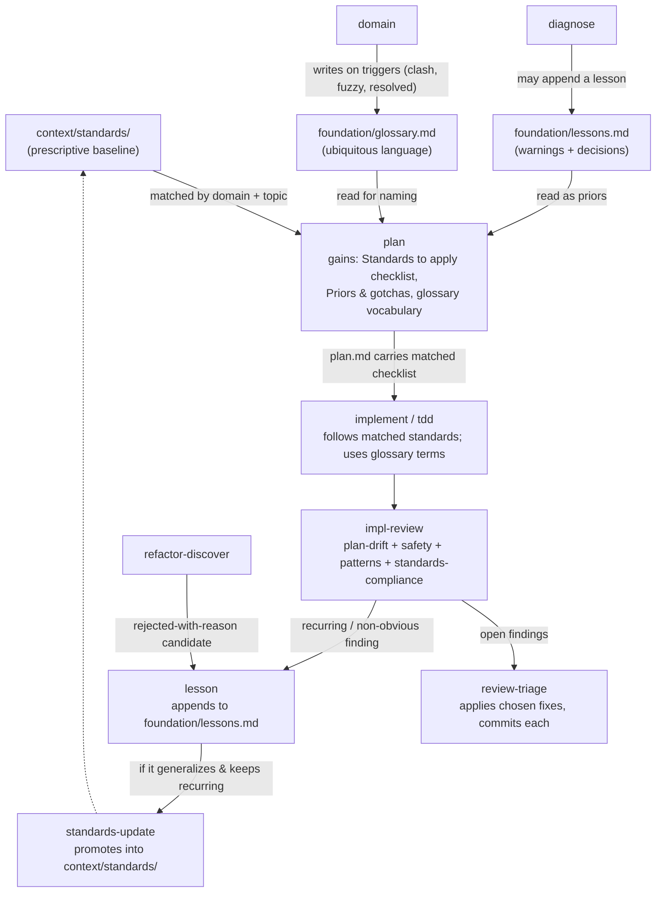

# dx — a software-development workflow (design)

> A software-development workflow: file-derived state, the user as the workflow engine, principles over ceremony. **`dx` is a prefix, not a product brand** — it ships as a set of skills under the **`dx-` prefix** in an **engineering** skill group (`dx-init`, `dx-new`, `dx-plan`, …), installed skill-by-skill via `npx skills`.
>
> **Shipped as a package of skills only — no dedicated agents.** See §3.
>
> **Two container levels:** *effort* (large, decomposes) ⊃ *change* (single shippable unit). See §4.
>
> **This doc is rationale only.** The skill inventory and directory layout are maintained in `docs/` (`docs/reference/skills.md`, `docs/explanation/directory-layout.md`) — don't re-add them here out of habit; add the *why*, not the *what*.

---

## 1. Design thesis

The workflow rests on a small set of load-bearing decisions:

- **File-derived state.** All state lives in markdown under `context/`: `change.md` identity, the `## Progress` contract as single source of truth. Nothing is maintained that can be derived — lists from `ls`, status from frontmatter, effort progress from child changes.
- **The user is the workflow engine.** No auto-chain: a skill does one job, suggests the next step, and stops — it never runs or auto-copies the next command. No orchestrators.
- **A first-class knowledge layer.** Standards (the rulebook), lessons (accrued warnings + decisions), and a domain glossary (ubiquitous language) — each a distinct artifact with its own lifecycle, read into plans and verified in review (§8).
- **Safety over speed.** Docs-vs-work separation; never auto-rollback on failure — the user confirms.
- **Alignment first.** A one-question-at-a-time **interview** is the cure for misalignment; **feedback-loop-first debugging** is the cure for guess-driven fixes. Both are reusable disciplines, not separate workflow tracks.

Everything speculative is cut. In particular: **no dedicated agents** (review gates run fine as skills — §3), **no HTML dashboards**, **no multi-phase orchestrators**, **no greenfield bootstrap ceremony**, **no issue-tracker coupling**, **no ADR register** (decisions live as lessons or standards — see §8).

The guiding rule: *trust Claude to reason — principles over process, references are maps not instructions.*

---

## 2. What's in and what's out

### Foundations — file-derived state
- `context/{foundation,standards,efforts,changes,archive}/` layout (§4–§5).
- `change.md` — frontmatter identity + lifecycle.
- `## Progress` checkbox section as **single source of truth**; resume = first unchecked `- [ ]`.
- Skills never auto-chain; each **suggests** the next command and stops (no clipboard automation — the user runs it).
- **Question-scaling from upstream artifacts** — don't re-ask what a frame/research doc (or a parent effort) already settled (§7.4).
- Implementer "siblings" (`implement` / `tdd`) sharing one Progress section so they interleave.
- Explicit handoff schemas between skills, no conversation-memory coupling.
- **`plan-review` and `impl-review` as skill-based gates** (pre- and post-implementation) — no agents needed (§3). **`review-triage`** is the single skill that acts on either gate's findings — the gates themselves stay report-only.

### The knowledge layer
- **Standards layer** at `context/standards/{global,frontend,backend,testing}/`, plus `standards-discover` and `standards-update` skills.
- **Docs-vs-work split** — stable reference docs (`foundation/`) kept distinct from active work artifacts (`changes/`, `efforts/`).
- **Standards folded into plans and verified in review** — the matching/apply/verify lifecycle expressed as skill behavior (§8).
- **Domain glossary** at `foundation/glossary.md` — ubiquitous language, glossary-only, no implementation detail. Seeded for brownfield by `domain-discover`, sharpened ongoing by `domain`, **read as a one-line habit by every skill, written only by the two domain skills.** Cuts verbosity and improves naming.

### Disciplines & vocabulary
- **User-confirmed rollback** as a hard, stated principle in the root `CLAUDE.md`: never auto-rollback on failure.
- **Feedback-loop-first debugging** as a model-invoked `diagnose` skill (§9).
- **Interview** as a reusable reference (the `interview` topic, loaded via `dx-references`) that `dx-frame` and `dx-plan` pull in — one question at a time, recommended answer each, decision-tree resolution (§10).
- **Deep-module design vocabulary** as a reference (the `module-design` topic via `dx-references`) — module / interface / depth / seam / deletion test — loaded by `dx-research`/`dx-frame`/`dx-plan` when the work is a refactor (§11).
- **User-invoked vs model-invoked** skill classification (`disable-model-invocation`) — light doctrine that cuts context load and forces an honest "would the model reach for this?" per skill (§13).
- The **vertical-slice / tracer-bullet** mental model, folded into how `roadmap` decomposes efforts and how `tdd` works (not as an issue tracker).

### Deliberately excluded
- **All orchestrators.** The user is the workflow engine. A migration is not a separate workflow — it's a change whose `plan.md` includes a rollback phase.
- **All dedicated agents.** Fan-out uses built-in `Explore`/`general-purpose`/`Plan` subagents. (§3.)
- HTML dashboards, `.html` companion reports, shared HTML style guides.
- Greenfield bootstrap chains and multi-phase orchestrators.
- **External issue-tracker sync** (`to-issues`, `to-prd`). Artifacts in `context/` are the source of truth. An optional sync adapter can be designed later; it is out of scope now.
- **ADRs.** Decisions and rationales live as **lessons** (cautionary) or **standards** (normative) — no third register.

---

## 3. Why no dedicated agents

A dedicated agent earns its keep in only two cases: a **hard, harness-enforced capability constraint** (read-only / write-limited) that a prompt alone can't guarantee, and **moving large reused instructions out of the main context**. Neither justifies the cost here:

- `impl-review` and `plan-review` already ran perfectly as **skills** — the reviewer/verifier roles do not need a separate persona or a hard tool restriction.
- `research` is what the built-in `Explore` subagent is for — spawn it with a prompt, no agent file needed.
- Every dedicated agent adds maintenance surface and one more routing/selection decision — a cost with no offsetting benefit here.

**Decision:** ship skills only. When the workflow needs fan-out or a constrained pass, it spawns built-in `Explore`/`general-purpose` subagents inline. If a future role ever proves it *must not* be violable by the model (e.g. a verifier caught editing files it should only check), that is the single criterion that would justify promoting it to a dedicated agent — but we start from zero and add only on observed need.

**Known limitation this accepts:** because `plan-review`/`impl-review` are skills, their reviewer discipline is prompt-based, not tool-enforced — nothing hard-stops a review skill from editing the code it is checking. This is acceptable for a personal, user-driven workflow; the day a review pass is caught fixing-and-hiding is the day that gate graduates to a tool-restricted agent (the promotion criterion above). `review-triage` is the deliberate escape valve for this constraint: findings need to turn into edits *somewhere*, so that somewhere is a separate skill, keeping both review gates pure.

This keeps the workflow a **single artifact type** (skills), simpler to ship, install, reason about, and document.

---

## 4. The two-level model: efforts and changes

The workflow has **two peer container levels** under `context/`. This is the structural backbone; everything else hangs off it.

### Why two levels
A single container (the change) cannot host work that *produces* changes — a large feature decomposed into slices, or a set of refactor opportunities. Those need their own upstream research/framing and a decomposition artifact, with nowhere to live if everything must sit inside one change. The effort is that home: **one level above the change, not nested inside it.**

### The two containers

| | **change** | **effort** |
|---|---|---|
| Size | A single shippable unit | A larger body of work |
| Identity | `change.md` | `effort.md` |
| Upstream artifacts | own `research/`, `frame.md` | own `research/`, `frame.md` (shared by children) |
| Plan artifact | `plan.md` (phases) | `roadmap.md` (vertical slices) |
| Spawns | nothing | child changes |
| Resume | first unchecked `## Progress` box | first unchecked roadmap slice |
| Lifecycle | new → planned → implementing → implemented → reviewed → archived | new → scoped → in-progress → done → archived |

A child change links back to its effort via `change.md` frontmatter (`effort: <id>`, `slice: <n>`) and **inherits the effort's research/frame** — handoff-scaling (§7.4) already says "skip what upstream settled," so a slice-change skips effort-level framing and jumps to its own plan. **No change-inside-a-change; no duplicated ceremony.**

### When to use which — `new` is the router
`new` is the universal entry point and decides the level (asks or infers from size/clarity):

- **Small / clear idea → change.** Standard flow: `new → research? → frame? → plan → implement → impl-review → archive`.
- **Large / needs splitting → effort.** `new → research → frame → roadmap → (per slice) new <effort> <slice> → plan → implement → impl-review`.

Freeform changes (no parent effort) remain fully first-class — `new` without an effort just makes a standalone change. Most work is a change; efforts exist for the cases that genuinely decompose.

**Optional brief seed.** Naming one or more `foundation/briefs/` slugs or paths anywhere in `new`'s argument seeds the container: `new` records the resolved paths in its `## Notes`, and `frame`/`plan` read them as settled upstream context (§7.5). Loose and plural by design — no flag, no required position, and an unrecognised name is asked about rather than guessed at. Naming none is the unchanged default. A brief never decides change-vs-effort; that stays `new`'s call.

### The five entry shapes
All entries converge on the same two-level model and the same change lifecycle:

```
A. small idea:    new → change → research? → frame? → plan → implement → review
B. large idea:    new → effort → research → frame → roadmap → (per slice) new → plan → implement
C. bug:           diagnose → cause → (trivial: fix) | (non-trivial: new + diagnosis.md → plan → implement)
D. refactor find: refactor-discover → findings → pick one (→ new change) or many (→ new effort + roadmap)
E. raw idea:      brainstorm → (nothing worth building | already covered) | (change | effort) + brainstorm.md
```

(C), (D) and (E) are **discovery-entry skills** — `diagnose`, `refactor-discover` and `brainstorm` — that promote a finding into a standard container and then get out of the way (§9). (E) is the only entry whose terminal outcome can be *no container at all*, and it is the step **before** (A)/(B) when nobody has yet decided the work is worth doing.

---

## 5. Directory layout

```
<engineering-group>/               # the dx- skill set (plugin root)
├── CLAUDE.md                      # root orientation + rollback principle + skill index
└── skills/
    ├── dx-<skill>/SKILL.md        # one directory per skill — current list derives from `ls`; see docs/reference/skills.md
    └── dx-references/             # shared reference docs, loaded on demand via a topic argument
        ├── SKILL.md               # invocable loader: takes a `topic`, reads references/<topic>.md, returns it
        └── references/<topic>.md  # change-md, effort-md, progress-format, plan-template, interview,
                                    # module-design, knowledge-layer, review-report, …
```

Skill directories don't get individually listed here — that list is exactly the kind of thing that must be derived, not maintained (§14 rule 9): it grows every time a skill is added, and a hand-kept copy would drift immediately. `docs/reference/skills.md` is the maintained inventory; `ls skills/` is the ground truth.

**Why references are an invocable loader skill.** `dx-references/SKILL.md` is a thin loader: a skill that needs a reference **invokes `dx-references` with a `topic` argument** (e.g. `interview`), and the loader reads `${CLAUDE_SKILL_DIR}/references/<topic>.md` and returns its contents. This removes disk-topology coupling entirely — no dx- skill needs to know where any *other* skill lives; only `dx-references` resolves a path, and only ever its own. `${CLAUDE_SKILL_DIR}` is guaranteed to resolve to the invoked skill's own directory at any install scope (personal, project, or plugin), so there is no symlink/sibling assumption left to break. The loader body:

```yaml
---
name: dx-references
description: Loads a specific dx reference document by topic. Invoked by other dx- skills to pull in shared reference material.
argument-hint: [topic]
user-invocable: false      # plumbing for other skills, not a `/dx-references` a human types
---
Read `${CLAUDE_SKILL_DIR}/references/$topic.md` and use its contents to complete
the current task. If it does not exist, list the files in
`${CLAUDE_SKILL_DIR}/references/` and report that the requested topic was not found.
```

Skills that load a reference (`dx-frame`, `dx-plan`, `dx-research`, `dx-refactor-discover`, the knowledge-layer consumers) name the **topic** instead of a path ("invoke `dx-references` with `interview`"). Model-invocation stays **enabled** (do not set `disable-model-invocation`) so a skill can reach the loader when instructed; the missing-topic branch does real work (lists available topics) so the one remaining failure mode is informative. Bonus: only the requested topic enters context (progressive disclosure), not the whole reference set.

Per-project `context/` layout (the tree that gets scaffolded into a target repo) is maintained in `docs/explanation/directory-layout.md` — not duplicated here.

---

## 6. Skill inventory (0 agents, 0 orchestrators)

> All skills ship under the **`dx-` prefix** (`dx-init`, `dx-new`, …). Plus **`dx-references`** — the shared reference-doc **loader** (§5), invoked by other skills to pull in shared docs by topic; it carries no workflow role of its own. The full per-skill table (invoke mode, purpose) is maintained in `docs/reference/skills.md` — not duplicated here.

**Model-invoked (2):** `diagnose`, `domain` — the only skills worth auto-firing (natural autonomous triggers). `research` is **user-invoked**: investigation is a deliberate act you initiate, not something the model should auto-reach for mid-task. `distill` is user-invoked for the same reason, and is a **foundation-layer producer, not a discovery entry** — it writes a brief (§7.5) and stops, promoting nothing. Everything else is user-invoked: the workflow is user-driven, and user-invocation pays zero context load. `interview` is a **reference loop**, not a skill. Effort and refactor are **types** handled by `new`, not separate skills.

Deliberately **not** included: product-design, performance, e2e-test-generation, bootstrapper, issue-tracker/sync, ADRs. Add later only if a real need appears.

---

## 7. Core contracts (the things that must be exact)

### 7.1 `change.md` — minimal, record-only
```yaml
---
change_id: oauth-login
status: new           # new → planned → implementing → implemented → reviewed → archived
---
```
Status transitions are **record-only** (not enforced). Derive everything else from `ls` and from the `## Progress` section. See `change-md.md` for the exact current schema.

### 7.2 `effort.md` + `roadmap.md`
```yaml
---
effort_id: payments-v2
status: new           # new → scoped → in-progress → done → archived
---
```
`roadmap.md` links an ordered list of slices, each to exactly one child change. Effort progress is **derived** — never a maintained checklist: for each slice, read its linked child change and count the ones with `archived_at` set. Done = every child change archived. Nothing flips a checkbox; there is no checkbox to flip (§14 rule 9). See `effort-md.md` for the exact current schema, including the roadmap's slice/`- change:`/`- why:`/`- next:` format.

### 7.3 `## Progress` — single source of truth (changes)
```markdown
## Progress
> `- [ ]` pending, `- [x]` done. Append ` — <short-sha>` when a step lands.

### Phase 1: <name>
#### Automated
- [x] 1.1 Migration applies cleanly — abc1234
#### Manual
- [ ] 1.2 Feature works in UI
```
Resume = first `- [ ]` in document order. Completion = `count([x]) / count( [ ]+[x] )`. Multiple implementer skills (implement/tdd) write this identically. Each phase should be a **vertical slice** where practical — end-to-end and demoable — not a horizontal layer pass.

### 7.4 Handoff scaling (question count vs. upstream artifacts)
Principle: *every artifact passed in — including a parent effort's — is a decision already made; don't re-ask it.* `plan` reads every available research file (change-scoped, parent-effort, `foundation/research/`, and `diagnosis.md` / `brainstorm.md` when present) as gathered context; it never re-spawns agents to find what a research file already mapped. The exact question-scaling table (upstream provided → questions to ask) lives in the `interview` reference (loaded via `dx-references`), which is the more current copy.

**Questioning is one question at a time (interview — §10), not a batch form.** The `interview` reference's counts are the *expected number* of interview questions for a complexity tier, scaled down by whatever upstream already settled. A **trivial** change gets a thin, single-phase plan with near-zero questions — `plan` is never skipped (it owns `## Progress`), but it scales down to almost nothing for small work, so there is no separate "no-plan" fast path to maintain.

### 7.5 Research — multi-topic, multi-mode
A change or effort can carry **multiple research files**, one per topic, in `research/<topic>.md` — codebase mode (via `Explore`, `file:line` refs) or external mode (via `WebFetch`/`WebSearch`, citations + fetch date), one file per topic per mode. The two modes, the provenance frontmatter schema, and the codebase/external branching are covered in `docs/explanation/research-and-frame.md` — not duplicated here.

**Two research homes:** change/effort-scoped (`<container>/research/<topic>.md`) is the default; `foundation/research/<topic>.md` holds durable, reusable investigations (the natural home for external-doc research) read by every plan.

**A sibling tier: `foundation/briefs/`.** `dx-distill` (user-invoked) runs a discovery conversation toward a decision and writes one `foundation/briefs/<slug>.md` — the problem, its scope, its rules and open risks, with **every substantive claim carrying an evidence tag and a source path**. Research is per-file provenance for one investigated topic; a brief is per-claim provenance across a decision's whole ground, and it is a conversation, not a sweep. It carries one companion, `<slug>.interview.md`, so `[INTERVIEW]` claims cite a checkable path like any other. `dx-distill` promotes nothing and creates no container — `dx-new` stays the sole router (§4).

### 7.6 Cross-skill formats — single source of truth
Every parsed format with more than one consumer has exactly one canonical definition; this is an index of where each lives, not a re-definition.

| Format | Canonical source | Consumers |
|---|---|---|
| `## Progress` checkbox rows | `progress-format.md` | `plan` (creates), `implement`, `tdd` (write), `review-triage`, `archive` (read) |
| `Resolution: PENDING` schema | `review-report.md` | `plan-review`, `impl-review` (write), `review-triage` (only writer of resolutions) |
| `change.md` frontmatter | `change-md.md` | every change-lifecycle skill (§7.1) |
| `effort.md` frontmatter + roadmap `- change:` lines | `effort-md.md` | `roadmap`, `new`, `archive` (§7.2) |
| `archived_at` derivation | `effort-md.md` / rule 9 (§14) | `archive` (writes it), `roadmap` (reads it to derive slice/effort completion) |
| Seed artifacts at a container root (`diagnosis.md`, `brainstorm.md`) | `dx-diagnose` / `dx-brainstorm` — each owns its own shape, collocated, not a shared reference | `plan`, `frame`, `roadmap` (read as settled upstream context) |
| Effort-level refactor seed (`## Notes` marker + one `research/<topic>.md` per finding) | `new` (writes both, from `refactor-discover`'s promote-many seed summary) | `roadmap` (reads every `research/<topic>.md` as a candidate slice, no edit of its own), `new` child-creation (reads the marker to stamp `type: refactor`) |
| Brief (`foundation/briefs/<slug>.md` + `<slug>.interview.md`) — evidence tags, id series, Coverage line | `dx-distill` — owns its own shape, collocated (same precedent as `diagnosis.md`/`brainstorm.md`) | `new` (resolves the briefs named in its argument into the container's `## Notes`), `frame`, `plan` (read those briefs as settled upstream context) |

---

## 8. The knowledge layer: standards, lessons & glossary

Three artifacts, all markdown, all in `foundation/` or `standards/`. They look similar (rules/terms in markdown) but do different jobs and have different lifecycles. **No ADR register** — a decision *with its rationale* ("we chose X over Y because Z") is recorded as a **lesson**; a rule everyone must follow is a **standard**. There is no third register.

| | **Standards** | **Lessons** | **Glossary** |
|---|---|---|---|
| Job | Normative baseline — *the rulebook* | Accrued scar tissue **+ load-bearing decisions** — *warnings & why-we-chose-X* | Ubiquitous language — *the terms* |
| Tone | Prescriptive: "do this" | Cautionary **or decisional**: "this broke / don't do X" · "we chose X over Y because Z" | Definitional: "X means Y" |
| Scope | Project-wide, stable, ahead-of-time | Specific to a finding, append-only | Project-wide, grows as terms crystallize |
| Origin | `standards-discover` / `standards-update` | Born from `impl-review`, `diagnose`, a rejected refactor, or a recorded design decision | Seeded by `domain-discover`, sharpened by `domain` |
| Lifecycle | Reference catalog, edited in place | Append-only; a recurring one **graduates** into a standard | Glossary-only file, edited in place |
| In a plan | Matched into a **Standards to apply** checklist | Surfaced as **Priors & gotchas** | Read for naming & verbosity (one-line habit) |

### The distinction that matters
- A **lesson** is the anteroom to a standard. `standards-update` is the promotion path when a lesson stops being "this one time" and becomes "how we do it here." A **rejected refactor opportunity** ("don't re-deepen the config loader — it's shallow on purpose because we swap backends") is a lesson, not an ADR. A **decision with rationale** ("we chose X over Y because Z") is likewise a lesson: the workflow has no separate decision register, and folding choices into `lessons.md` keeps one append-only home for "things a future change should not relitigate."
- The **glossary** is *never* a spec, scratch pad, or home for implementation decisions — it is a glossary and nothing else. Every skill **reads** it as a one-line habit; only `domain-discover` and `domain` **write** it.

### The lifecycle (how each skill reads/writes them)


The full contract (matching heuristics, lesson entry shape, promotion criteria, glossary entry shape) lives in the **`knowledge-layer`** reference (loaded via `dx-references`) on demand by `dx-plan`, `dx-impl-review`, `dx-standards-update`, `dx-lesson`, `dx-domain`, and `dx-refactor-discover`.

### Minimalist fallback
If three registers ever feels like overhead, collapse standards + lessons into one `context/standards/` tree where each entry carries `source: discovered | learned` (the consumption logic is identical), and keep the glossary separate (it is a different shape — terms, not rules). Start with three — the consumption differs enough to be worth the separation — but the collapse is a one-step simplification if it isn't.

---

## 9. Discovery-entry skills: `diagnose`, `refactor-discover` and `brainstorm`

All three are **discovery entries** — you start from a symptom, a hunting instinct, or a raw idea rather than a known target. Each produces a finding, then **promotes it into a standard container and gets out of the way.** None writes a durable register; the finding lives inside the container it spawns and archives with it.

### `diagnose` (model-invoked)
Feedback-loop-first. The skill is: **build a tight, red-capable feedback loop before any hypothesis.** Phases: build loop → reproduce + minimise → hypothesise (3–5 ranked, falsifiable) → instrument → fix → regression test → cleanup.

- **Default — ad-hoc, no container:** runs on a symptom, finds the cause. Trivial fix → fix inline + leave the regression test. No artifacts.
- **Promote — when the fix is non-trivial:** creates a change via `new` (stamped `type: defect`, which activates the TDD gate — §14 rule 7) carrying `diagnosis.md` (minimised repro + ranked hypotheses + regression test), then the fix flows through normal `plan → implement → impl-review`.

`diagnosis.md` is read by `plan` exactly the way `research.md` is — a bug-fix change is just a change whose "research" is a diagnosis. Triggers: "it's broken / slow / throwing / failing." Reachable mid-`implement` or from `impl-review` on a regression.

### `refactor-discover` (user-invoked)
Run with no concrete target — "find me refactor opportunities." Scans the codebase through two references (both loaded via `dx-references`): `module-design` (deep vs shallow modules, seams, deletion test), which is the primary lens **and** the sole vocabulary every finding is phrased in, and `design-lenses` (SRP and the rest of SOLID, KISS, YAGNI, DRY, coupling, orthogonality), which widens what gets found without adding a second way to say it. Presents findings **inline** (markdown, no HTML), and you pick. Before promoting, each pick can optionally be **designed twice** — 3–4 built-in `Plan` subagents in parallel, each under a forcing constraint stated as *where the seam goes* (collapse to 1–3 entry points, move contract out of the interface, split the seam by caller, ports & adapters), compared on depth/locality/seam placement and closed with an opinionated pick — two designs sharing an entry point count as one. Picking exactly one candidate keeps the plain yes/no; picking more than one gets a single batched question (*none* / *all* / *specific ones*, recommending the top pick) and then the same explore-and-confirm loop runs once per selected finding, sequentially — never more than one finding's sub-agent batch in flight at a time. The winning sketch(es) ride into the promoted container's seed so `plan` doesn't re-derive them; the skill still writes no `plan.md` and edits no code. Then:

- **one** → spawn a single change (`type: refactor`) seeded with that finding as its research/frame.
- **many** → hand the picks to `new` as a seed summary (a `## Refactor opportunities` heading `new` detects and parses, not a short idea); `new` writes the effort plus one `research/<topic>.md` per finding and a `## Notes` marker recording it's a refactor effort, then `roadmap` decomposes the research files into slices — one per finding, no edit of its own needed — and each slice becomes a child refactor-change stamped from that marker (§7.6).

A candidate **rejected with a load-bearing reason** → offered as a **lesson** ("don't re-deepen X because Y") so the next run doesn't re-suggest it. Rejected ephemerally or selected → no durable trace. **No `foundation/architecture-debt.md` register** — refactor findings are ephemeral work items, not stable reference knowledge, and a shared register would create stale-entry and parallel-write hazards that fight the workflow's derive-don't-maintain principle.

### `brainstorm` (user-invoked)

Runs on a raw idea **before** `new`, when nobody has yet decided the work is worth doing. Interactive-only: it exists to ask about appetite and constraints, so an unattended invocation stops rather than inventing them. Climbs a source ladder before questioning (glossary + lessons → standards → open and archived containers → codebase → the user), then diverges — restate the problem without the user's proposed solution, ≥2 genuinely different alternatives plus a **priced** do-nothing, the riskiest assumption and its cheapest test — and converges through the `interview` reference's adversarial pass. Four ramps:

- **Nothing worth building** → no container, no artifact, no `Next:`. A terminal success, not a failed run — the only entry in the workflow whose best outcome writes nothing.
- **Already covered** by an open or archived container → cite the path, stop.
- **One shippable unit** → `changes/<id>/change.md` + `brainstorm.md`.
- **≥2 independently shippable capabilities** (the *bundling test*: would each function without the other?) → `efforts/<id>/effort.md` + `brainstorm.md`. Identity file only — decomposing into slices stays `roadmap`'s job, child changes stay `new`'s.

`brainstorm.md` carries what neither research nor a frame has a home for: the alternatives weighed, why the do-nothing lost, and what is explicitly *not* being done. It is read as **settled context** by `plan`, `frame`, and `roadmap` (§7.6) — which is why running `/dx-frame` on top of a brainstorm deepens the conclusion instead of colliding with it, and why the artifact is deliberately not `frame.md`.

This makes the three a clean set: discovery-entry skills that promote a finding into a standard container, then hand off to the normal workflow.

---

## 10. Interview (a reference loop, not a skill)

The interview is the cure for the dominant failure mode — **misalignment**. Extracted as the `interview` reference (loaded via `dx-references`): ask one question at a time, each with a recommended answer, walking the decision tree until every branch resolves. If a question can be answered by exploring the codebase, explore instead of asking.

- **`frame` = deep interview** on problem framing + alternatives → `frame.md`.
- **`plan` = interview on its open questions.** When **no `frame.md` exists**, `plan` runs a front-loaded interview pass on the framing questions `frame` would have asked, then interviews on solution-design. When `frame.md` exists, `plan` skips framing and interviews only on solution design (per §7.4 handoff scaling).

Net: **the interview always happens.** `frame` makes the framing half explicit and skippable as its own step; when skipped, `plan` absorbs it. You never lose the alignment cure, and small work can still skip a separate `frame` step.

---

## 11. Refactor as a change-type

Refactoring is first-class but flows through the **same change lifecycle** — it is a `type: refactor` (or an effort of refactor-changes), not a separate workflow.

A refactor change activates conditional characteristics (mirroring the existing conditional-phase rule: migration → rollback phase, defect → TDD gate) — the module-design vocabulary and the behavior-preserving gate. The exact list of characteristics is the "Conditional phases by type" entry in `plan-template.md` and the `module-design` reference (both loaded via `dx-references`) — not restated here.

A refactor can be a single change (one isolated deepening) or an effort + roadmap (a cluster surfaced by `refactor-discover`). Same bones as any change; the type just activates the gate and the vocabulary.

---

## 12. Standards seed (minimal)

Ship three files under `context/standards/global/` (each ~20–30 lines):

- **`coding-style.md`** — naming, formatting, descriptive names, focused functions, no dead code, DRY.
- **`minimal-implementation.md`** — build what's called, no future stubs, no speculative abstractions, delete exploration artifacts, unused code is debt. *(Directly enforces the "no over-engineering" rule the author cares about.)*
- **`conventions.md`** — predictable structure, env vars over secrets, minimal deps, feature flags, changelog.

`frontend/`, `backend/`, `testing/` ship **empty**. `standards-discover` populates them per-project from the actual codebase + config, so no inherited opinions land where they don't fit.

---

## 13. User-invoked vs model-invoked

Light doctrine, big payoff in context load and routing clarity:

- **User-invoked** (`disable-model-invocation: true`) — reachable only by typing the name; description is human-facing, trigger lists stripped; **zero context load**. The workflow is user-driven, so most skills are this.
- **Model-invoked** (default) — reachable by model or user; description keeps rich trigger phrasing so auto-invocation fires. Reserve for skills the model should reach autonomously.

Only two skills are model-invoked — `diagnose` ("it's broken/slow"), `domain` (term clash / fuzzy term). `research` is user-invoked: investigation is a deliberate act you initiate. The test per skill: *could the model usefully reach for this on its own?* If not, it's user-invoked and pays no context load.

---

## 14. What "lean" means here (anti-ceremony rules)

To keep this from drifting back into bloat, the workflow obeys:

1. **State is markdown, never a sidecar.** No `*.yml` state files. `change.md`/`effort.md` frontmatter + `## Progress` is all.
2. **No HTML anywhere.** Reports are markdown. No dashboards.
3. **No auto-chain, no auto-copy.** A skill finishes → **prints** the suggested next command → stops. It never copies to the clipboard and never runs the next step; the user decides what runs. Model-invoked skills (`diagnose`, `domain`) may fire mid-task; when they do, they complete their unit of work and then likewise suggest the next step rather than silently resuming the skill they interrupted.
4. **Skills only — no dedicated agents.** Fan-out uses built-in `Explore`/`general-purpose`/`Plan` subagents. (§3.)
5. **References are maps.** Each doc under `dx-references/references/` stays conceptual, no full implementations.
6. **Two container levels — no nesting.** Effort ⊃ change. A change never lives inside another change; large work is an effort that spawns flat child changes. (§4.)
7. **Conditional phases by type.** A plan activates phase characteristics by `type` (defect → TDD gate, refactor → behavior-preserving gate, migration → rollback phase) — encoded in `plan.md`, not by an orchestrator at runtime.
8. **No skill without a `context/` read or write.** This single rule excludes anything that isn't part of the workflow.
9. **Derive, don't maintain.** Lists come from `ls`; status comes from frontmatter; effort progress comes from child changes. No index files, no registers to keep in sync.
