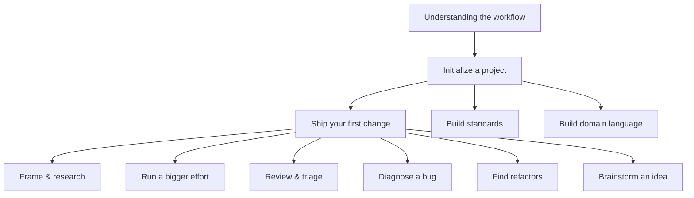

# dx workflow documentation

A lean, file-derived software-development workflow shipped as Claude Code **skills** under the `dx-` prefix
(`dx` for *developer experience* — just the naming prefix for this skill set, not a product name).
Each skill does one job, writes markdown to `context/`, prints the next suggested command, and stops — **you**
are the workflow engine. These docs teach you how to use the skills, from your first `/dx-init` to shipping
changes, running efforts, and building up your project's knowledge layer.

New here? Read [Understanding the dx- workflow](explanation/workflow-overview.md) first, then follow
[Initialize a project](tutorials/initialize-a-project.md) and [Ship your first change](tutorials/ship-a-change.md).

---

## Suggested reading order

1. **Understand it** — [Understanding the dx- workflow](explanation/workflow-overview.md).
2. **Set it up** — [Initialize a project](tutorials/initialize-a-project.md).
3. **Ship something** — [Ship your first change](tutorials/ship-a-change.md).
4. **Go deeper** — the tutorials and explanations below, in any order.

---

## Tutorials — *learn by doing*

Hands-on, start-to-finish walkthroughs with realistic you↔agent conversations.

| Tutorial | What you'll do |
|---|---|
| [Initialize a project](tutorials/initialize-a-project.md) | Scaffold `context/` with `/dx-init` and create your first work item |
| [Ship your first change](tutorials/ship-a-change.md) | Take a change from `/dx-new` to `/dx-archive` end to end |
| [Use frame and research](tutorials/frame-and-research.md) | Prepare a fuzzy change with the two optional upstream steps |
| [Run a bigger effort](tutorials/run-an-effort.md) | Decompose large work into vertical slices with a roadmap |
| [Build and maintain standards](tutorials/build-standards.md) | Seed and grow your project's rulebook |
| [Build and maintain domain language](tutorials/build-domain-language.md) | Seed and sharpen the project glossary |
| [Brainstorm an idea](tutorials/brainstorm-an-idea.md) | Diverge on a raw idea with `/dx-brainstorm` before committing to it |
| [Diagnose a bug](tutorials/diagnose-a-bug.md) | Feedback-loop-first debugging with `/dx-diagnose` |
| [Find refactoring opportunities](tutorials/find-refactors.md) | Scan for deepening opportunities and promote them |
| [Review and triage](tutorials/review-and-triage.md) | Run the two review gates and act on their findings |

## Explanations — *understand why*

Conceptual background on how the workflow is designed and why.

| Explanation | The concept |
|---|---|
| [Understanding the dx- workflow](explanation/workflow-overview.md) | The whole workflow, its thesis, and the lifecycle |
| [The `context/` directory layout](explanation/directory-layout.md) | File-derived state and the docs-vs-work split |
| [Efforts and changes](explanation/efforts-and-changes.md) | The two-level container model |
| [The knowledge layer](explanation/knowledge-layer.md) | Standards, lessons, and the glossary |
| [Research and frame](explanation/research-and-frame.md) | The two upstream artifacts and the interview |
| [Divergent and convergent work](explanation/divergent-vs-convergent.md) | Why `/dx-brainstorm` diverges before any container converges on a plan |
| [Plans and vertical slices](explanation/plan-and-slices.md) | Multi-phase plans and the `## Progress` contract |
| [Handoff scaling](explanation/handoff-scaling.md) | Scaling plan questions to what upstream settled |
| [Implement vs TDD](explanation/implement-vs-tdd.md) | The two implementer siblings |

## Reference — *look it up*

| Reference | Contents |
|---|---|
| [Skill reference](reference/skills.md) | Every `dx-` skill: invoke, purpose, reads, writes, next |
| [Glossary](reference/glossary.md) | Definitions of dx- workflow terms |

---

## The one thing to remember

Skills **never auto-chain**. Each finishes its one job, prints a `Next:` suggestion, and stops — you decide
what runs next. Nothing is auto-rolled-back on failure; you confirm first. All state is plain markdown under
`context/`, so you can always read, edit, and reason about exactly where you are.

For the full design rationale (aimed at people working *on* the skills, not just using them), see
[`../DESIGN.md`](../DESIGN.md).
