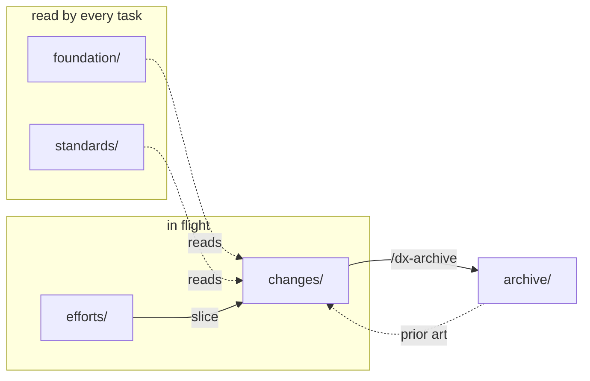

# Understanding the `context/` directory

When you run `/dx-init`, dx- creates a single directory in your project: `context/`. Everything the
workflow knows — your standards, your accrued lessons, the change you're planning right now, the
efforts you finished last quarter — lives there as plain Markdown. There is no database, no hidden
state file, no index to keep in sync. This page explains how that directory is laid out and why it
looks the way it does.

## The core idea: file-derived state

dx- holds one rule above the layout: **nothing is maintained that can be derived.** State that a
program could reconstruct from the files themselves is never written down a second time.

- The list of active changes? That's `ls context/changes/`.
- The status of a change? Read the `status:` field in its `change.md` frontmatter.
- How far along an effort is? Scan its child changes and count how many are archived.
- Which step of a plan comes next? The first unchecked `- [ ]` in the plan's `## Progress`.

Because all of that is *derivable*, dx- keeps no registers, no `index.md`, no sidecar `.yml` state
file, no manifest. There is nothing to fall out of date, because there is nothing to update. A stale
index is a class of bug that simply cannot exist here. The cost is real but small: sometimes a skill
reconstructs state by scanning a few files instead of reading one summary line. The benefit is that
what you see on disk is always the truth — `git log` and `ls` are the whole status system.

> Note: this `context/` tree is the **per-project scaffold** your adopting project receives. It is a
> different thing from the **skill-repo layout** (`skills/dx-*/SKILL.md`), which only matters to people
> maintaining the dx- skills themselves — as an adopter you never touch it.

## The docs-vs-work split

The five top-level folders divide into three bands by how stable their contents are:

- **Reference docs** — `foundation/` and `standards/` — change slowly and are read by almost every
  task. These are your project's stable memory: its vocabulary, its rules, its durable research.
- **Active work** — `changes/` and `efforts/` — is where the thing you are building right now lives.
  High churn, short-lived, one directory per unit of work.
- **Finished work** — `archive/` — is where a change or effort goes when it ships. Read-only in
  practice; kept for prior-art searches.

Keeping these bands apart matters for two reasons. **Safety:** stable reference docs never get
tangled up with the noise of in-flight work, so you can trust `standards/` and `foundation/` even
while three changes are mid-flight. **Clarity:** when you open `changes/`, everything there is live;
when a unit of work is done it *leaves* `changes/` entirely and moves to `archive/`, so the active
folder never accumulates stale directories. You always know what's in play by looking at one place.

## The scaffold

This is what `/dx-init` writes into your repo. The two `<...>` folders (`efforts/<effort-id>/`
and `changes/<change-id>/`) are templates — one such directory is created per effort or change as you
work; they don't exist until you run `/dx-new`. `foundation/briefs/` is the same: `/dx-distill` creates
it the first time you write a brief.

```
context/
├── foundation/        # stable reference docs
│   ├── glossary.md            # ubiquitous language (glossary-only) — seeded by domain-discover
│   ├── lessons.md             # accrued warnings — append-only
│   ├── research/              # durable, reusable investigations (read by every plan)
│   ├── briefs/                # <slug>.md + <slug>.interview.md — written by /dx-distill
│   │                          #   (created on first use, not by /dx-init)
│   └── vision.md / roadmap.md / tech-stack.md   # optional project orientation
├── standards/         # the prescriptive baseline
│   ├── global/        # SEED: coding-style.md, minimal-implementation.md, conventions.md
│   ├── frontend/      # empty — filled by standards-discover
│   ├── backend/       # empty
│   └── testing/       # empty
├── efforts/<effort-id>/
│   ├── effort.md
│   ├── research/              # shared upstream research (read by child changes)
│   ├── frame.md               # shared framing (read by child changes)
│   ├── brainstorm.md          # optional; when promoted from /dx-brainstorm
│   └── roadmap.md             # vertical slices; each → a child change
├── changes/<change-id>/
│   ├── change.md              # carries effort/slice/type when applicable
│   ├── research/<topic>.md    # one file per research topic
│   ├── frame.md               # optional
│   ├── diagnosis.md           # optional; when promoted from /dx-diagnose
│   ├── brainstorm.md          # optional; when promoted from /dx-brainstorm
│   ├── plan.md                # owns ## Progress; carries matched Standards + Lessons
│   └── reviews/               # plan-review.md / impl-review.md
└── archive/<YYYY-MM-DD>-<id>/ # archives both efforts and changes
```

## The five top-level folders

| Folder | What lives there | Who writes it | Lifecycle |
|---|---|---|---|
| `foundation/` | Project-wide memory: `glossary.md` (ubiquitous language), `lessons.md` (accrued warnings), durable `research/`, `briefs/` (decisions and the [evidence](evidence-tags.md) behind them), and optional `vision.md` / `roadmap.md` / `tech-stack.md`. | `/dx-domain-discover` and `/dx-domain` seed the glossary; `/dx-lesson` appends lessons; `/dx-research` writes durable research; `/dx-distill` writes briefs. | Long-lived. `lessons.md` is append-only. Read by nearly every plan. |
| `standards/` | The prescriptive baseline — how code *should* be written. `global/` is seeded with three starter standards; `frontend/`, `backend/`, `testing/` start empty. | `/dx-init` seeds `global/`; `/dx-standards-discover` mines the rest; `/dx-standards-update` edits and promotes graduated lessons. | Long-lived. Grows as your conventions harden. Matched into every plan and checked at review. |
| `efforts/` | One directory per **effort** (larger work spanning several changes). Holds `effort.md`, shared `research/` and `frame.md`, optional `brainstorm.md`, and a `roadmap.md` of vertical slices. | `/dx-new` creates the directory; `/dx-roadmap` decomposes it into slices. | Medium-lived. Spawns child changes; moves to `archive/` when done. |
| `changes/` | One directory per **change** (a single shippable unit). Holds `change.md`, `research/`, optional `frame.md` / `diagnosis.md` / `brainstorm.md`, `plan.md` (which owns `## Progress`), and `reviews/`. | `/dx-new` creates it; `/dx-research`, `/dx-frame`, `/dx-plan`, `/dx-implement`, and the review skills fill it. | Short-lived. Active until shipped, then moves to `archive/`. |
| `archive/` | Finished efforts and changes, each under a dated `<YYYY-MM-DD>-<id>/` directory. | `/dx-archive` moves a completed `changes/<id>/` or `efforts/<id>/` here and stamps `archived_at`. | Permanent, effectively read-only. Searched for prior art by `/dx-research` and `/dx-plan`. |

A `change.md` carries its own frontmatter — `change_id`, `title`, `type`, `effort`, `slice`, `status`,
and timestamps. Its `status` walks `new → planned → implementing → implemented → reviewed → archived`
as the change moves through the workflow. An effort's `effort.md` walks a parallel track,
`new → scoped → in-progress → done → archived`. Nothing tracks those transitions but the frontmatter
itself — flip the field, and that *is* the status change. See
[efforts and changes](efforts-and-changes.md) for how the two units relate, and
[plan and slices](plan-and-slices.md) for how `plan.md` and its `## Progress` drive implementation.

## Where the split shows up in practice



Reference folders feed *into* active work — every plan reads your standards, lessons, and glossary.
Active work flows one direction: an effort spawns changes, a change ships, and shipping means
*leaving* `changes/` for `archive/`. The archive then feeds back as prior art, closing the loop
without any of it needing an index to track what's where.

## Trade-offs and what was deliberately left out

The whole layout is one bet: **derive, don't maintain.** dx- deliberately ships without the
bookkeeping most workflows accrete:

- **No index or manifest files.** The directory listing *is* the index. Adding a register would mean
  a second source of truth that can disagree with the files — the exact staleness dx- refuses.
- **No sidecar `.yml`/`.json` state.** Status lives in Markdown frontmatter you can read and edit by
  hand. There is no machine-only state you can't inspect in a text editor.
- **No status dashboards or HTML.** `ls`, `git log`, and frontmatter answer every "where are we"
  question. A dashboard would be one more thing to keep current.
- **No auto-updated progress database.** A plan's `## Progress` checklist is the progress record;
  effort progress is *computed* by scanning child changes, never stored.

The honest cost: to answer "how far along is this effort?" a skill scans the effort's changes rather
than reading a cached number. That scan is cheap and, crucially, cannot lie. In exchange you get a
state layer that is impossible to corrupt through neglect — there is no register to forget to update,
so nothing silently goes stale.

## Related

- [Efforts and changes](efforts-and-changes.md) — the two units of work that fill `efforts/` and `changes/`.
- [The knowledge layer](knowledge-layer.md) — how `foundation/` and `standards/` flow into every plan and review.
- [Plans and slices](plan-and-slices.md) — how `plan.md` owns `## Progress`, and how effort slices become child changes.
- [Workflow overview](workflow-overview.md) — the full lifecycle that reads and writes this tree.
- [Initialize a project](../tutorials/initialize-a-project.md) — the hands-on tutorial that runs `/dx-init` and creates this scaffold.
