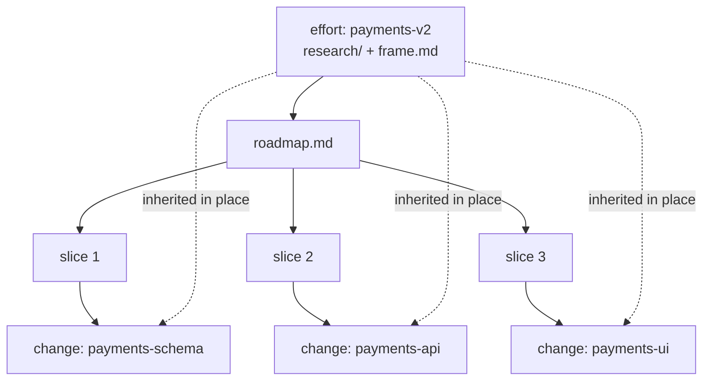

# Understanding efforts and changes

dx- organizes all of your work into containers on disk. There are exactly **two
levels** of container, and understanding how they relate is the fastest way to
understand the whole workflow — every other concept hangs off this structure.
This page explains the two levels, why there are only two, and how a piece of
work flows into one or the other.

## The core idea: two peer levels, never nested

Under a project's `context/` directory, dx- gives you two kinds of container:

- A **change** is one shippable unit of work — a feature, a bug fix, a single
  refactor. It lives at `context/changes/<change-id>/`. Adding Google sign-in
  (`oauth-login`) is a change.
- An **effort** is a larger body of work that *produces* changes — a big feature
  split into slices, or a cluster of related refactors. It lives at
  `context/efforts/<effort-id>/`. Rebuilding the payments flow (`payments-v2`)
  is an effort.

The two are **peers**, not a hierarchy of arbitrary depth. An effort sits
**one level above** a change, and a change never contains another container. The
rule to remember: **no change-inside-a-change.** An effort produces changes; a
change produces nothing but the shipped work itself.

Both live side by side under the same scaffold:

```
context/
├── efforts/
│   └── payments-v2/          # an effort
│       ├── effort.md
│       ├── research/
│       ├── frame.md
│       └── roadmap.md
└── changes/
    ├── oauth-login/          # a freeform change (no parent effort)
    │   ├── change.md
    │   ├── frame.md
    │   └── plan.md
    └── payments-schema/      # a child change of payments-v2
        ├── change.md         # effort: payments-v2, slice: 1
        └── plan.md
```

## Why two levels and not one

A single container — the change — works fine for most work. You have an idea,
you plan it, you implement it, you ship it. But a change **cannot host work that
produces other changes**. Consider `payments-v2`: rebuilding the payments flow
is too big to plan and ship as one unit. It needs to be split into slices
(`payments-schema`, `payments-api`, `payments-ui`), each of which is itself a
shippable change.

That larger work needs three things a lone change has no place for:

1. Its own **upstream research and framing** that applies to the whole body of
   work, not just one slice.
2. A **decomposition artifact** that records how the work breaks into slices.
3. A way for each slice to become a real change **without repeating** the
   research and framing already done upstream.

Forcing this into a change would mean nesting changes inside a change, or
duplicating the framing into every slice. The effort is the home that avoids
both: it holds the shared upstream work once, and each slice inherits it.

## The two containers compared

| | change | effort |
|---|---|---|
| Size | A single shippable unit | A larger body of work |
| Identity file | `change.md` | `effort.md` |
| Upstream artifacts | own `research/`, `frame.md` | own `research/`, `frame.md` (shared by children) |
| Plan artifact | `plan.md` (phases) | `roadmap.md` (vertical slices) |
| Spawns | nothing | child changes |
| Resume | first unchecked `## Progress` box | first roadmap slice whose child change isn't archived |
| Lifecycle | new → planned → implementing → implemented → reviewed → archived | new → scoped → in-progress → done → archived |

The upstream artifacts (`research/`, `frame.md`) are explained on their own page,
[research and frame](research-and-frame.md); the plan and roadmap artifacts are
covered in [plan and slices](plan-and-slices.md). This page only cares about how
the two containers relate.

## The identity files

Each container is defined by one small frontmatter file plus free-form notes.
Everything else — which artifacts exist, how far execution has gotten — is
**derived** from the folder and its files, never tracked by hand.

A change is `change.md`:

```yaml
---
change_id: oauth-login        # kebab-case, matches folder name
title: Add Google sign-in
type: feature                 # feature | defect | refactor | migration
effort: null                  # parent effort-id, or null for a freeform change
slice: null                   # index within the effort roadmap, or null
status: new                   # record-only lifecycle
created: 2026-07-01
updated: 2026-07-01
archived_at: null
---

## Notes
<free-form>
```

An effort is `effort.md`:

```yaml
---
effort_id: payments-v2
title: Rebuild payments flow
status: new                   # new → scoped → in-progress → done → archived
created: 2026-07-01
updated: 2026-07-01
archived_at: null
---

## Goal
<one paragraph — what success looks like for the whole effort>

## Notes
<free-form>
```

The `status` field in both is **record-only**: a skill stamps the transition it
causes, but nothing blocks on it. Status is a note about where the work is, not a
gate that enforces order.

## How the two connect: `/dx-new` routes, children inherit

You never choose a container by hand-editing files. `/dx-new` is the **router**:
it looks at the idea and decides the level.

- A small, clear idea becomes a **change** directly — `/dx-new oauth-login`
  makes a standalone (freeform) change with `effort: null`.
- A large idea that needs splitting becomes an **effort** — `/dx-new` scaffolds
  `effort.md`, then you research, frame, and build a `roadmap.md` of slices.

Once an effort has a roadmap, each slice becomes a **child change** with its own
`/dx-new` call that names the parent:

```text
/dx-new payments-v2 1
```

This creates the change for slice 1 (`payments-schema`) and sets `effort:
payments-v2` and `slice: 1` in its `change.md` frontmatter. Crucially, the child
**inherits the effort's `research/` and `frame.md` in place** — nothing is
copied. Because the upstream framing already exists one level up, the child skips
effort-level framing entirely and can jump straight to its own `/dx-plan`. It can
also run `/dx-frame payments-schema` first: since the effort's `frame.md` already
covers the problem and alternatives, this narrower **slice mode** interviews only
on flows specific to this slice and writes a small `frame.md` of its own holding
just `## User cases` — additive to the effort's headline sketch, not a redo of it.

This is why there is **no duplicated ceremony**: the research and framing that
apply to all of `payments-v2` are written once, on the effort, and every slice
reads them from there. The inheritance is what makes two levels cheaper than
either nesting or copying. The mechanics of scaling the handoff this way are
covered in [handoff scaling](handoff-scaling.md).



## Progress is derived, never maintained

An effort has **no checkbox to flip** when a slice finishes. Its progress is
computed on demand: scan each slice in `roadmap.md`, read the linked child
change, and count the ones with `archived_at` set. The effort is **done** when
every child change has been archived. There is no hand-maintained status line on
the effort that can drift out of sync with reality — the child changes *are* the
source of truth, and the effort just reads them.

The same principle applies within a single change: execution state is the first
unchecked box in its `## Progress` list, not a field someone remembers to update.
Derive, don't maintain.

## The four entry shapes

Every way work enters dx- converges on the same two-level model and the same
change lifecycle. There are four shapes:

```
A. small idea:    new → change → research? → frame? → plan → implement → review
B. large idea:    new → effort → research → frame → roadmap → (per slice) new → plan → implement
C. bug:           diagnose → cause → (trivial: fix) | (non-trivial: new + diagnosis.md → plan → implement)
D. refactor find: refactor-discover → findings → pick one (→ new change) or many (→ new effort + roadmap)
E. raw idea:      brainstorm → (nothing) | (already covered) | (one change + brainstorm.md) | (an effort + brainstorm.md)
```

Shapes C, D, and E start at a **discovery** skill (`/dx-diagnose`,
`/dx-refactor-discover`, `/dx-brainstorm`) that investigates first and then
promotes its finding into a standard container — one change, or an effort with
a roadmap — and gets out of the way. Whatever the entry, the destination is
always a change or an effort, and the change lifecycle downstream is identical.

`/dx-brainstorm` is the discovery entry that may deliberately promote
**nothing** — concluding the idea isn't worth building is a valid terminal
outcome, not a failed run. When it does route, it also hands over the
change-vs-effort level rather than leaving it for `/dx-new` to re-derive: its
bundling test — *would each capability function without the other?* — already
made that call.

## Trade-off: only two levels, on purpose

dx- deliberately stops at two levels. There is no sub-effort, no program
above an effort, no arbitrarily deep tree. This is a cut, and it is intentional.

Two levels map cleanly onto how software actually ships: the atomic unit is a
shippable change, and the only thing bigger is a body of work that *produces*
several of them. A deeper hierarchy would invite endless bucketing — grouping
efforts into initiatives into portfolios — that adds ceremony without helping you
ship the next unit. When something feels bigger than an effort, the answer is not
a new container level; it is a second effort. Keeping the model flat is what lets
progress stay derived and the whole structure stay legible from an `ls`.

## Related

- [Workflow overview](workflow-overview.md) — how the full lifecycle runs on top of these two containers.
- [Plan and slices](plan-and-slices.md) — how `plan.md` phases and `roadmap.md` slices are structured.
- [Research and frame](research-and-frame.md) — the shared upstream artifacts a change or effort owns.
- [Handoff scaling](handoff-scaling.md) — why a child change inherits and skips work already settled upstream.
- [Divergent and convergent work](divergent-vs-convergent.md) — why `/dx-brainstorm` diverges before any of these shapes converge.
- [Ship a change](../tutorials/ship-a-change.md) — walk a single change end to end.
- [Run an effort](../tutorials/run-an-effort.md) — decompose a large body of work into child changes.
