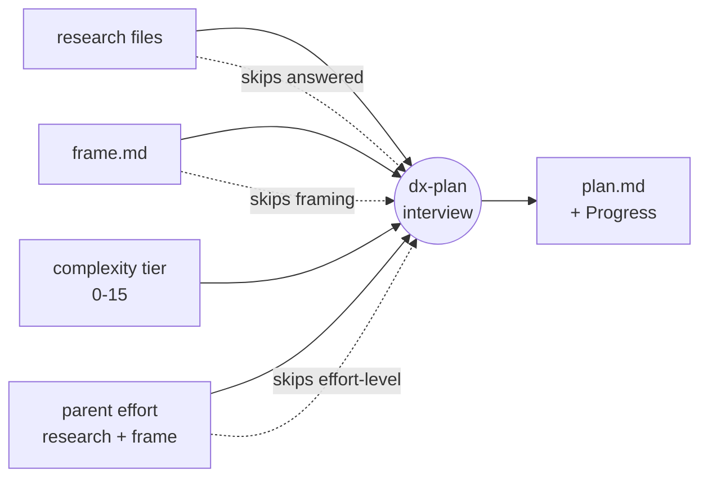

# Understanding handoff scaling

`/dx-plan` always runs an interview before it writes a plan. Left unchecked, that
interview would re-litigate decisions you already made upstream — asking what the
problem is when a `frame.md` already stated it, or asking which library to use when a
research file already mapped the options. Handoff scaling is the rule that stops this.
It makes `/dx-plan` count its interview questions against what the upstream artifacts
already settled, and skip anything already decided.

## The core principle

> **Every artifact passed in — including a parent effort's — is a decision already made.
> Don't re-ask it.**

An interview question exists to resolve an open decision. If research, a `frame.md`, or a
parent effort's research and frame already resolved that decision, the question has no
job left to do. `/dx-plan` reads those artifacts as settled input and asks only about
what remains open. The more you prepared upstream, the shorter the interview — the well-
prepared change flies through planning, and the cold-start change gets the full
treatment. Same skill, scaled to the situation.

This is [one-question-at-a-time interviewing](research-and-frame.md), not a batch form
with a fixed field count. The interview walks a decision tree, resolving one branch at a
time; handoff scaling prunes the branches that upstream already closed before the loop
ever reaches them.

## Complexity sets the starting length

Before any scaling-down happens, a change's complexity sets the *expected* interview
length:

| Complexity | Expected questions |
|---|---|
| trivial | 0–2 |
| low | 4–6 |
| medium | 7–10 |
| high | 11–15 |

That is the count for a **cold start** — task description only, nothing prepared
upstream. From there, whatever the upstream artifacts already settled scales the count
*down*.

A trivial change lands near zero: `/dx-plan` produces a thin, single-phase plan and asks
almost nothing. But it is still never skipped — `/dx-plan` owns the `## Progress` section
that tracks implementation, so every change passes through it. That is deliberate: rather
than maintain a separate "no-plan" fast path for tiny work, the one plan path simply
scales down to almost nothing. One path, fewer moving parts.

## The scaling table

Upstream artifacts subtract from that starting count:

| Upstream provided | Questions to ask |
|---|---|
| Task description only | full (complexity-scaled: trivial 0–2 / low 4–6 / medium 7–10 / high 11–15) |
| + research | skip what any research file already answered |
| + frame.md | skip all problem-framing questions |
| + frame + research | solution-design questions only |
| + parent effort's research + frame | skip all effort-level upstream; solution-design only |

Read top to bottom, each row prepares more and asks less. A [`frame.md`](research-and-frame.md)
settles the problem framing and the alternatives considered, so `/dx-plan` skips the
whole framing half of the interview. Research files map the codebase and the external
options, so `/dx-plan` skips whatever they already answered. With both present, only
solution-design questions remain.

The last row is where an [effort's child change](efforts-and-changes.md) pays off. A slice
of the `payments-v2` effort — say `payments-api` — inherits the effort's research and
frame through its `change.md` frontmatter. So the slice's `/dx-plan` treats all
effort-level framing as already decided and jumps straight to solution-design questions
about that slice. No re-framing "what are we building and why" once per slice — the effort
answered that once, for all of them. The one exception is user cases: the effort's frame
keeps those to a headline sketch (its slices don't exist yet at framing time), so a slice
may run `/dx-frame` again itself, in a narrower mode, to add just its own flows before
`/dx-plan` — still nothing re-asked, only something new added.

## `/dx-plan` reads research; it does not re-run it

Handoff scaling also governs what `/dx-plan` does with research. It **reads** every
available research file as gathered context:

- change-scoped research (`context/changes/oauth-login/research/<topic>.md`),
- the parent effort's research,
- shared `foundation/research/`,
- and `diagnosis.md` when a [diagnosis](../tutorials/diagnose-a-bug.md) produced one.

It never re-spawns agents to rediscover what a research file already mapped. A research
file is a finished decision about the terrain; re-running the exploration would just
re-ask it in a slower form. `/dx-plan` trusts the file and moves on.

## How the pieces reduce the question set

Complexity opens the interview at some length; each upstream artifact prunes it before
`/dx-plan` writes `plan.md`.

## What this makes possible

Handoff scaling is the mechanism that makes the optional upstream steps actually pay off.
Without it, running [`/dx-research` and `/dx-frame`](research-and-frame.md) first would be
pure overhead — you would answer the framing questions once in `/dx-frame`, then answer
them again in `/dx-plan`. Because handoff scaling skips settled decisions, the work you
put into framing and research is *subtracted* from the plan interview instead of
duplicated. Preparation converts directly into a shorter interview.

The same mechanism is what lets an [effort decompose into child changes](efforts-and-changes.md)
without ceremony. The effort frames the problem and researches the terrain once; every
slice inherits that and jumps to its own solution design. Handoff scaling is the rule that
turns "the effort already decided this" into "the slice doesn't ask about it."

## Trade-offs and what was left out

**The counts are guidance, not a quota.** The tiers (0–2, 4–6, 7–10, 11–15) describe the
*expected* shape of an interview, not a target `/dx-plan` must hit. The real rule is
narrower and firmer: never re-ask a settled decision. If a medium change turns out to
need only three questions because research answered the rest, three is correct — the tier
was never a floor to pad up to. Treating the numbers as a rigid quota would reintroduce
exactly the busywork handoff scaling exists to cut.

**No separate fast path.** dx- deliberately does not ship a "skip planning for small
changes" shortcut. That would be a second code path to keep in sync with the first, and a
place for `## Progress` to go missing. Scaling the single plan path down to near-zero for
trivial work achieves the same speed with none of the divergence.

**No cross-artifact reconciliation engine.** Handoff scaling trusts each upstream artifact
at face value — it does not diff a stale research file against the current codebase or
detect that a `frame.md` contradicts a later research finding. That trust is the price of
simplicity. If an upstream artifact is wrong, you refresh it (research files are
independently refreshable) rather than have `/dx-plan` second-guess it.

## Related

- [Research and frame](research-and-frame.md) — the interview loop itself, and why the
  framing interview always happens even without a `frame.md`.
- [Plan and slices](plan-and-slices.md) — what `/dx-plan` writes once the interview
  resolves: `plan.md` and its `## Progress` section.
- [Efforts and changes](efforts-and-changes.md) — how a child change inherits its parent
  effort's research and frame, which the last scaling-table row rewards.
- [Frame and research tutorial](../tutorials/frame-and-research.md) — a hands-on walk
  through preparing the upstream artifacts that shorten the plan interview.
