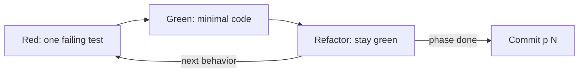

# Understanding `/dx-implement` vs `/dx-tdd`

Once a change has a plan, someone has to write the code. dx- gives you two skills for that:
`/dx-implement` (standard) and `/dx-tdd` (test-first). They are **siblings**, not rivals. They read and
write the *same* `## Progress` section, use the *same* commit ritual, and can interleave freely inside a
single change — some phases standard, some test-first. The only thing that differs is the ordering of work
*within* a phase. This page explains what they share, where they diverge, and how to pick one phase to
phase.

## One phase per invocation

Both skills execute **exactly one phase** of `context/changes/oauth-login/plan.md` per run — never the whole
plan. A phase is a vertical slice, end-to-end and demoable, described by the plan and tracked by a block of
`## Progress` rows. You run the skill, it does one phase, it prints a `Next:` line, and it stops. You run it
again for the next phase. Nothing auto-chains. (See [plan and slices](plan-and-slices.md) for how phases get
carved up in the first place.)

Because each invocation is scoped to one phase, the *choice* of sibling is also per-phase. There is no
up-front decision to make the whole change "a TDD change" or "a standard change." You decide as you go.

## What both siblings share

Everything except the inner loop. These mechanics are identical between `/dx-implement` and `/dx-tdd`:

**Resume from `## Progress`.** The resume point is the **first `- [ ]` in document order**. The
`### Phase N:` heading above that unchecked box is the phase to run. There is no sidecar state file, no status
flag to consult — the plan's checkboxes *are* the execution record. (See
[plan and slices](plan-and-slices.md) for the row shape.)

**Flip the lifecycle status.** On the first run, if `change.md` still says `status: planned`, the skill flips
it to `implementing` (and stamps `updated`). When every box is `- [x]`, it sets `status: implemented`. The
frontmatter always reflects where the change actually is.

**Verify before you check a box.** Each phase carries `#### Automated` checks (tests, build, migration) and
sometimes `#### Manual` checks. A `- [ ]` flips to `- [x]` **only** when its check genuinely passes.
`#### Manual` boxes need a human to confirm. And critically — **fail loud**: if a check is red, missing, or
skipped, the skill stops and reports. It never quietly marks a box done. A green Progress section means the
work is really green.

**One commit per phase.** When a phase lands it becomes a single Conventional Commit:

```text
<type>(<change-id>): <phase title> (p<N>)
```

for example `feat(oauth-login): add callback route (p2)`. Then the skill appends the short SHA to every
Progress row that landed in that commit (` — abc1234`). Rows are never renumbered, deleted, or duplicated;
follow-ups are added as new boxes. A manual-only phase with no code diff commits nothing and leaves its rows
SHA-less.

**Never auto-rollback.** If something fails, the skill stops and reports — it does not revert your work. Most
failures are a one-line fix, not a reason to throw away a phase. If the cause isn't obvious after a quick
look, it escalates to [`/dx-diagnose`](../tutorials/diagnose-a-bug.md) rather than guessing at more fixes.
This mirrors the rollback principle written into every dx- project's `CLAUDE.md`.

Because the Progress contract is shared byte-for-byte, a phase driven by `/dx-tdd` and the next phase driven
by `/dx-implement` leave an indistinguishable record. That is the whole point.

## Where they diverge: the inner loop

### `/dx-implement` — standard

Straightforward. For the resumed phase: write the code, run the `#### Automated` checks, check the boxes that
pass, commit. If reality contradicts the plan, it stops and asks rather than improvising silently. That's it.

### `/dx-tdd` — test-first

Same phase, same rows, same commit — but the **failing test comes before the code**. Each `#### Automated`
row is one trip around the **red → green → refactor** loop, taken behavior by behavior:

- **Red** — write **one** failing test for the next behavior. Run it. Confirm it fails for the *right* reason
  (a real assertion or "not implemented", not a broken import). Never `skip`/`xit` to fake a pass — the
  failure is the point.
- **Green** — write the **minimal** production code to pass that one test. One test → one slice of code.
  Never write all the tests up front, and never write more code than the current test demands.
- **Refactor** — clean up while the suite stays green. Skip it when there's nothing to clean.

A row flips to `- [x]` only when its check passes on a green *full* suite.



If a phase genuinely can't be driven by a failing test — pure scaffolding, config, infra wiring — `/dx-tdd`
says so and hands the phase to `/dx-implement`. It does not fake a test to satisfy the ritual.

## When to reach for which

| Situation | Sibling |
|---|---|
| Plan `type` activated a **TDD gate** (e.g. `type: defect`) | `/dx-tdd` |
| Any behavior you can express as a failing test first | `/dx-tdd` |
| Feature work where test-first isn't required | `/dx-implement` |
| Scaffolding, config, wiring — no behavior to assert yet | `/dx-implement` |
| A phase that starts as infra then adds logic | `/dx-implement` the wiring, then `/dx-tdd` the logic |

You can mix within one change. A realistic `oauth-login` run might `/dx-implement` the "add config +
routes" scaffolding phase, then `/dx-tdd` the "validate the callback state token" phase where the behavior is
worth pinning with a red test first, then `/dx-implement` the final "wire the UI button" phase.

## The tie to plan `type`

The plan's `type` field is what nudges you toward a sibling:

- **`defect`** activates a **TDD gate**. A bug is a behavior your code currently gets wrong, so it expresses
  cleanly as a failing test — write the test that reproduces the bug (red), fix until green. When
  [`/dx-diagnose`](../tutorials/diagnose-a-bug.md) promotes a `checkout-total` bug into a change, that change
  gets `type: defect`, which is your signal to reach for `/dx-tdd`.
- **`refactor`** activates a **behavior-preserving gate**: the suite must be green *before* and *after*, with
  no behavior change in between. That pairs naturally with either sibling — you're not adding behavior, just
  proving you didn't remove any.
- **`feature`** (like `oauth-login`) leaves the choice to you, phase by phase.

The gate itself is expressed as conditional phases in the plan — see
[plan and slices](plan-and-slices.md) for how a `type` seeds the phases and their `#### Automated` rows.

## Trade-offs / what was deliberately left out

**No separate "test generation" skill.** dx- doesn't ship a skill that writes tests for you as a distinct
step. Tests are written *inside* `/dx-tdd`'s red step, by the same run that writes the code, so the test and
the code it constrains stay in one loop. A bolt-on test generator would produce tests decoupled from the
red-green discipline — tests that assert *what* the code does rather than *why* it should.

**No orchestrator deciding which sibling to run.** There is no meta-skill that inspects a phase and picks
`/dx-implement` vs `/dx-tdd` for you. **You pick**, per phase, when you type the command. That keeps the
decision cheap and — because both siblings write one identical Progress contract — **reversible phase to
phase**. If you start a phase standard and realize a failing test would have served better, nothing is
locked; the next phase can go the other way with no migration and no bookkeeping. An orchestrator would add a
layer of guessing where a one-word command already does the job.

## Related

- [Plan and slices](plan-and-slices.md) — how a plan's phases, `type`, and conditional gates are shaped
  before you implement.
- [The knowledge layer](knowledge-layer.md) — the standards and lessons that bind each phase you implement.
- [Ship a change](../tutorials/ship-a-change.md) — a full walkthrough that runs `/dx-implement` end to end.
- [Diagnose a bug](../tutorials/diagnose-a-bug.md) — how a `type: defect` change is born, then driven with
  `/dx-tdd`.
