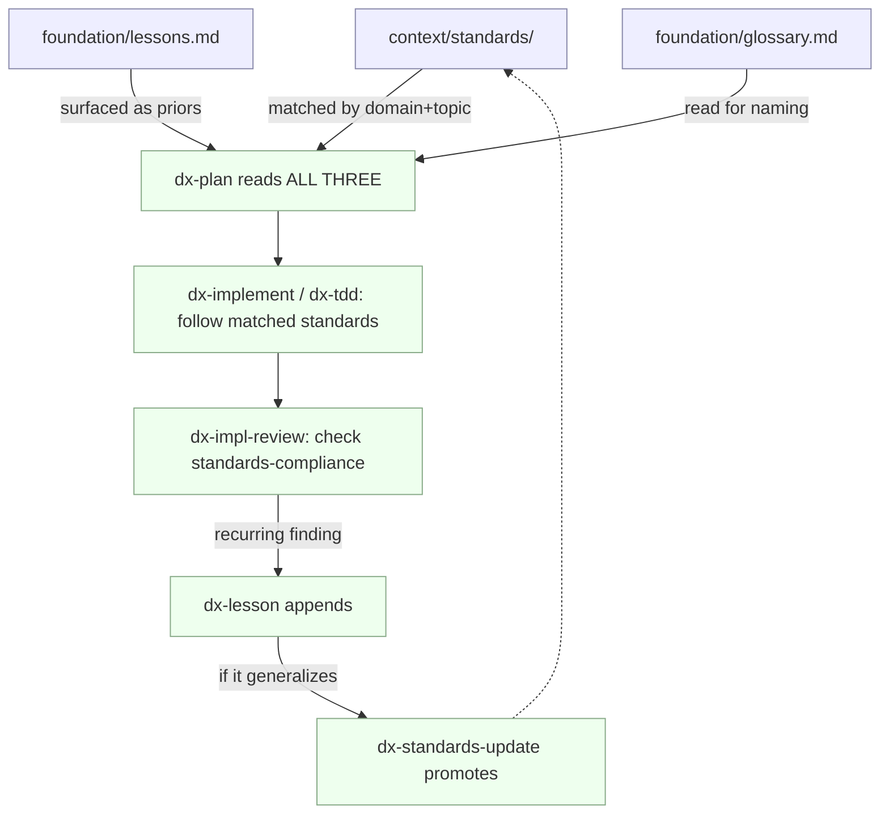

# Understanding the knowledge layer

Every project accumulates knowledge that outlives any single change: rules the
team agreed to follow, scars from things that broke, and the precise meaning of
domain words. Left in people's heads, that knowledge decays. dx- writes it down
as three plain-markdown artifacts under your project's `context/` and
`foundation/` folders — and, crucially, keeps them **separate** even though they
all look like "rules or terms in a markdown file." This page explains why they
are three things, not one, and how they feed each change you ship.

## Core concept: three artifacts, three jobs

The three artifacts are **standards**, **lessons**, and the **glossary**. They
resemble each other on the surface — each is markdown, each holds short entries —
but they answer different questions and change on different schedules.

| | Standards | Lessons | Glossary |
|---|---|---|---|
| **Job** | Normative baseline — the rulebook | Accrued scar tissue + load-bearing decisions | Ubiquitous language — the terms |
| **Tone** | Prescriptive: "do this" | Cautionary / decisional: "this broke" / "we chose X over Y because Z" | Definitional: "X means Y" |
| **Lives in** | `context/standards/{global,frontend,backend,testing}/` | `foundation/lessons.md` | `foundation/glossary.md` |
| **Scope** | Project-wide, stable | Specific finding, append-only | Project-wide, grows as terms crystallize |
| **Origin** | `/dx-standards-discover`, `/dx-standards-update` | `/dx-impl-review`, `/dx-diagnose`, rejected refactor, recorded decision | `/dx-domain-discover` seeds, `/dx-domain` sharpens |
| **Lifecycle** | Catalog, edited in place | Append-only; a recurring one graduates into a standard | Glossary-only file, edited in place |
| **In a plan** | Matched → "Standards to apply" checklist | Surfaced → "Priors & gotchas" | Read for naming (a one-line habit) |

Read the table top to bottom for any one column and you get that artifact's whole
character. Read it left to right on any one row and you see why they can't be
merged: a rulebook edited in place behaves nothing like an append-only log of
things that went wrong.

### Standards — the rulebook

A **standard** is a rule the project follows ahead of time, written before any
particular change needs it. Standards live under
`context/standards/`, split by domain so a plan pulls only what's relevant:
`global/` for project-wide rules, and `frontend/`, `backend/`, `testing/` for
area-specific ones. They are prescriptive ("do this"), stable, and edited in
place like any reference catalog.

`/dx-init` seeds three global files:

- `context/standards/global/coding-style.md` — naming, formatting, focused
  functions, no dead code, DRY.
- `context/standards/global/minimal-implementation.md` — build what's called, no
  speculative abstractions, unused code is debt.
- `context/standards/global/conventions.md` — predictable structure, env vars
  over secrets, minimal deps, feature flags, changelog.

The `frontend/`, `backend/`, and `testing/` folders ship **empty**.
`/dx-standards-discover` fills them per-project by reading your actual codebase
and config, so no inherited opinions land where they don't fit. A standards file
is just a title and one `##` per rule:

```markdown
# Coding style

## Descriptive names over comments
Prefer names that explain intent so the code reads without a comment. Reserve
comments for *why*, never *what*.

## No dead code
Delete unused code the moment it's unreferenced. Version control is the archive.
```

### Lessons — scar tissue and decisions

A **lesson** records something the project learned the hard way, or a decision it
does not want to relitigate. There is exactly one file — `foundation/lessons.md` —
and it is **append-only**: you add entries, you don't rewrite history. Two flavors
live side by side:

- **Cautionary** — "this broke because…". Born from `/dx-impl-review` catching a
  recurring finding, or `/dx-diagnose` tracing a class of bug.
- **Decisional** — "we chose X over Y because Z". This includes a refactor that
  was deliberately *rejected*: "don't re-deepen `config-loader` — it's shallow on
  purpose because we swap backends behind it."

Every lesson has the same shape:

```markdown
## <short title> — <YYYY-MM-DD>
<what happened / decided>. **Why:** <reason it matters>. **How to apply:** <rule going forward>.
```

A concrete one:

```markdown
## OAuth callback must validate state — 2026-07-11
An early Google sign-in attempt skipped the `state` check and was open to CSRF.
**Why:** the callback trusts whatever the browser presents. **How to apply:**
always compare the returned `state` to the one stored server-side before
exchanging the code.
```

### Glossary — the ubiquitous language

The **glossary** (`foundation/glossary.md`) pins down what domain words mean, so
"account," "order," or "session" means one thing across code, plans, and
conversation. It is definitional and nothing else. Entries carry a definition and,
optionally, the term they're easily confused with:

```markdown
**Customer**: a person or organization that holds a paid subscription.  _Avoid_: confusing with **User** (any authenticated identity, paid or not).
```

The glossary is **never** a spec, a scratch pad, or a home for implementation
decisions — those are standards and lessons. Every skill **reads** it (see below),
but only `/dx-domain-discover` (which seeds terms) and `/dx-domain` (which sharpens
a term the moment it clashes or turns out to be vague) **write** it.

## The distinctions that matter

Two boundaries do most of the work of keeping these three artifacts honest.

**A lesson is the anteroom to a standard.** A lesson starts life as "this one
time." When it stops being a one-off and becomes "how we do it here" — it keeps
recurring across changes — `/dx-standards-update` **promotes** it into
`context/standards/`. That is the *only* promotion path. Nothing else moves a
lesson into the rulebook, and nothing demotes a standard back. The direction is
always lessons → standards, and it happens only when generality has been proven by
repetition.

**A decision-with-rationale is a lesson, not an ADR.** dx- has **no ADR
register** — no `decisions/` folder, no numbered architecture-decision records.
When you choose X over Y for reason Z, that goes in `foundation/lessons.md` as a
decisional entry. Folding decisions into the same append-only log keeps one home
for "things a future change should not reopen," instead of a parallel file that
drifts out of sync. If you're reaching for an ADR, write a lesson.

## How the layer flows through a change

The knowledge layer isn't a library you visit on the side — it's wired into the
change lifecycle. Here's the path, artifact by artifact.



In prose:

1. **`/dx-plan` reads all three.** It matches standards into the plan's
   "Standards to apply" checklist (by domain × topic — only the files that touch
   this change's area, not the whole tree), surfaces relevant lessons as
   "Priors & gotchas," and draws vocabulary from the glossary. Reading the
   glossary here is a one-line habit that keeps naming consistent, not a section
   of its own. See [plan and slices](plan-and-slices.md) for the full plan shape.
2. **`/dx-implement` or `/dx-tdd` follows the matched standards** carried in
   `plan.md`, and uses glossary terms in the code it writes. (Which of the two you
   run depends on change type — see
   [implement vs TDD](implement-vs-tdd.md).)
3. **`/dx-impl-review` checks standards-compliance** alongside plan-drift and
   safety, and when it spots a *recurring* finding it offers to "record as a
   lesson."
4. **`/dx-lesson` appends** that finding to `foundation/lessons.md`.
5. **`/dx-standards-update` promotes** the lesson into `context/standards/` if it
   generalizes and keeps recurring — closing the loop back to where the next
   plan starts.

Note what does *not* happen automatically: no skill chains into the next. Each
prints a `Next:` suggestion and stops, so recording a lesson or promoting a
standard is always a deliberate step you take, never a silent side effect.

Two discovery entries also feed the layer. `/dx-diagnose` may append a lesson when
a class of bug recurs, and `/dx-refactor-discover` offers a rejected candidate as a
lesson ("don't re-deepen X because Y") so the next scan doesn't re-suggest it.

## Trade-offs and what was deliberately left out

**No ADR register.** A third register for architecture decisions would be pure
overhead: lessons already hold decisions-with-rationale, and standards hold the
rules those decisions harden into. A separate ADR file would duplicate one and
drift from the other. The cut is deliberate — one append-only log for "don't
relitigate this," one catalog for "always do this."

**No architecture-debt register either.** Refactor findings are ephemeral work
items, not stable reference knowledge, so `/dx-refactor-discover` spawns changes
rather than maintaining a `foundation/architecture-debt.md`. A shared debt file
would invite stale entries and parallel-write conflicts that fight dx-'s
derive-don't-maintain grain.

**Why three and not two?** There's a real minimalist fallback: standards and
lessons could collapse into a single `context/standards/` tree where each entry
carries a `source: discovered | learned` field — the consumption logic is
identical — while the glossary stays separate because it's a different shape
(terms, not rules). dx- starts with **three** anyway, because how you *consume*
each one differs enough to be worth the separation: standards get matched into a
checklist, lessons get surfaced as priors, the glossary gets read for naming. If
the three ever feel heavy, the collapse to two is a one-step simplification —
but you start with the version that keeps the distinct jobs visible.

## Related

- [Efforts and changes](efforts-and-changes.md) — the change lifecycle these
  artifacts feed into, and where a plan sits in it.
- [Research and frame](research-and-frame.md) — the earlier steps that also read
  the glossary and lessons for alignment.
- [Plan and slices](plan-and-slices.md) — how `/dx-plan` turns matched standards
  and surfaced lessons into a concrete checklist.
- [Build your standards](../tutorials/build-standards.md) — hands-on: discover and
  promote standards for a real project.
- [Build your domain language](../tutorials/build-domain-language.md) — hands-on:
  seed and sharpen the glossary.
