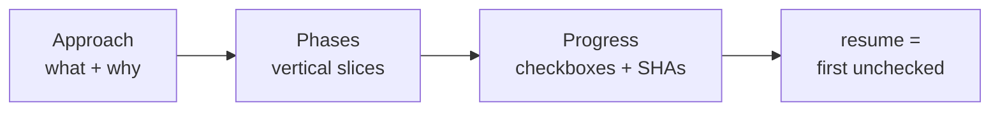

# Understanding the plan and its slices

Every change in dx- passes through `/dx-plan`. The plan is where upstream context — the change record,
any research, any framing — becomes a concrete solution design, and where the workflow decides *how* the
work gets built and *in what order*. This page explains the shape of that design: the `plan.md` file, why
its phases are cut as vertical slices, and the `## Progress` section that becomes the single source of
truth for execution.

## Plan is never skipped

The tempting shortcut is a "no-plan" fast path for tiny changes — just start editing. dx- does not have
one, on purpose. `/dx-plan` owns the `## Progress` section, and `## Progress` is the *only* record of
execution state the workflow keeps. Skip the plan and there is nothing for `/dx-implement` to resume from,
nothing for a review to check against, nothing that says a change is half-done.

So instead of an on/off switch, the plan **scales down**. A trivial change gets a thin, single-phase plan
written after near-zero interview questions. A large feature gets several phases and a longer interview.
The floor is not zero — it is "one phase and a Progress section" — but the ceiling is as high as the work
needs. There is one path, and it stretches.

The plan lives at `context/changes/<id>/plan.md`. For the running example — the `oauth-login` change,
"Add Google sign-in" — that is `context/changes/oauth-login/plan.md`. Writing it flips the change from
`status: planned` and hands off to implementation.

## The shape of `plan.md`

`/dx-plan` writes a fixed set of sections. Each one has a job:

```markdown
# Plan: <title>

## Approach
<the chosen solution in a few sentences — what and why, drawn from the interview>

## Data model / API & contracts / Failure modes & reversibility
<conditional — present only when the change actually touches that concern>

## Standards to apply
> Matched from context/standards/ by domain + topic. A checklist the implementer follows and impl-review verifies.
- [ ] <standard>: <one-line how it applies here>

## Priors & gotchas
> From foundation/lessons.md — decisions already made and scar tissue not to relitigate.
- <lesson that bears on this change>

## Phases
### Phase N: <name>   — vertical slice where practical
<what this phase delivers end-to-end>

## Progress
<the execution single-source-of-truth — see below>
```

- **Approach** is the decision, in prose. It captures *what* solution was chosen and *why*, distilled from
  the plan interview. A reader should be able to understand the direction without reading the phases.
- **Data model**, **API & contracts**, and **Failure modes & reversibility** are conditional — each
  appears only when the change actually touches that concern (a schema change, a caller-facing
  interface, an external call or migration). `/dx-plan` gates them with a one-line relevance trigger
  before interviewing, so a trivial change carries none of them. A section is **omitted entirely**
  when it doesn't apply — never written as `N/A` — because the silence itself is what
  `/dx-plan-review` checks: a wrongly-absent section is exactly as reachable in review as a
  present-but-wrong one.
- **Standards to apply** is a checklist, not a narrative. `/dx-plan` matches your `context/standards/`
  files by domain and topic and pulls only the relevant ones in. The implementer follows the list;
  `/dx-impl-review` verifies against the same list. It is the contract between planning and review.
- **Priors & gotchas** surfaces the relevant lines from `foundation/lessons.md` — decisions and scar
  tissue that a new change should not relitigate. If a past change learned "don't re-deepen the config
  loader, it is shallow on purpose," that lesson lands here so the implementer doesn't undo it.
- **Phases** is the ordered breakdown of the work, cut into slices (next section).
- **Progress** is the live execution record (the section after that).

## Vertical slices, not horizontal layers

The most important choice a plan makes is how it cuts phases. dx- cuts them as **vertical slices** —
tracer bullets — wherever practical.

A vertical slice is end-to-end and demoable. For `oauth-login`, a sliced plan looks like:

- **Phase 1** — the callback route stores a session and redirects: schema → API → a working (ugly) sign-in.
- **Phase 2** — the real Google button and the account-linking edge cases.

Contrast the horizontal alternative: "Phase 1: all the schema. Phase 2: all the API. Phase 3: all the UI."
That reads tidy but nothing works until the last phase lands. There is nothing to demo, nothing to test
against a user-visible outcome, and no way to stop early with something shippable.

The vertical cut buys three things:

- **Visibility.** Each phase produces something you can look at and click. Progress is real, not "80% of
  the plumbing."
- **Testability.** A slice that goes schema→api→ui can be exercised end-to-end, so its `## Progress` checks
  assert behavior a user cares about, not just that a layer compiles.
- **Early exit.** If priorities change after Phase 1, you have shipped a coherent piece rather than three
  disconnected halves.

This is the same slicing idea an effort's roadmap uses, one level up. An effort decomposes into slices,
each spawning a child change; a change decomposes into phases. Same instinct — deliver something whole at
each step — applied at two scales. See [efforts and changes](efforts-and-changes.md) for the effort level
and [run an effort](../tutorials/run-an-effort.md) for it in practice.

## The `## Progress` contract

`## Progress` is the execution single-source-of-truth. It is worth reading the format closely, because
`/dx-implement` and `/dx-tdd` both write it and every other skill reads it:

```markdown
## Progress
> `- [ ]` pending, `- [x]` done. Append ` — <short-sha>` when a step lands in a commit.

### Phase 1: <name>
#### Automated
- [x] 1.1 Migration applies cleanly — abc1234
#### Manual
- [ ] 1.2 Feature works in UI
```

The rules are few and exact:

- **Resume = the first `- [ ]` in document order.** There is no cursor, no "current step" flag. To pick up
  where work left off, an implementer scans top to bottom and starts at the first unchecked box.
- **Completion = `count([x]) / count([ ] + [x])`.** How-done-is-this is *counted* from the section, never
  stored separately.
- **`#### Automated` vs `#### Manual`.** Automated steps are agent-verifiable — a test passes, a build
  succeeds, a migration applies. Manual steps need a human to confirm — "feature works in the UI." Splitting
  them tells the implementer which boxes it may check itself and which it must hand to you.
- **Append the short SHA when a step lands.** Flip `- [ ]` to `- [x]` and add ` — abc1234`, the commit that
  landed it. That ties each finished step to a point in history.
- **Never renumber or delete landed rows.** Step numbers are stable references. Follow-up work becomes new
  boxes, not edits to old ones.

Because `/dx-implement` and `/dx-tdd` write this section *identically*, they interleave freely. A defect
inside a feature can be handled test-first with `/dx-tdd` for one phase and `/dx-implement` for the next —
the Progress section reads the same either way. Which one to use, and why, is covered in
[implement vs TDD](implement-vs-tdd.md).

Mid-flight, `oauth-login`'s Progress might read like this:

```markdown
### Phase 1: Callback stores session
#### Automated
- [x] 1.1 Migration applies cleanly — abc1234
- [x] 1.2 Callback exchanges code for token — abc1234
#### Manual
- [x] 1.3 Sign-in redirects and sets a session — abc1234

### Phase 2: Google button + account linking
#### Automated
- [ ] 2.1 Existing account links by email
#### Manual
- [ ] 2.2 Button renders and completes sign-in
```

Phase 1 is fully checked; the first `- [ ]` is `2.1`, so that is exactly where the next `/dx-implement`
resumes — no state stored anywhere but these boxes. Completion here is four done of six, or 67%, counted
straight off the checkboxes.



## Conditional phases by `type`

A plan is not one fixed template. The change's `type` — set on `change.md` when you run `/dx-new` —
activates a characteristic that shapes the phases. There is no runtime orchestrator making this happen;
`/dx-plan` reads the `type` and *encodes* the characteristic directly into the plan text. The type is a
switch at planning time, not a controller at execution time.

| `type` | Activated characteristic in the plan |
|---|---|
| `feature` | None. Straight vertical-slice phases. |
| `defect` | A **TDD gate**: the first phase writes a failing regression test that reproduces the bug, and only then the fix. The test proves the bug existed and that it is gone. |
| `refactor` | A **behavior-preserving gate**: tests must be green *before and after*, and a phase asserts observable behavior is unchanged while depth, locality, or testability improve. `/dx-plan` also loads the `module-design` vocabulary — deep vs shallow modules, seams, the deletion test — so the plan talks about *shape*, not features. |
| `migration` | A **user-confirmed rollback phase**: an explicit, deliberate rollback step. dx- never auto-rolls-back on failure — the plan makes the rollback a step a human confirms. |

The `oauth-login` example is a `feature`, so it gets plain sliced phases. Change its type to `defect` and
the same skill front-loads a failing-test phase instead.

## How the knowledge layer folds in

Two of the plan's sections are populated straight from your project's accumulated knowledge, and one habit
runs quietly through the whole write:

- **Standards** → the **Standards to apply** checklist. `/dx-plan` matches `context/standards/` (for
  example `context/standards/global/coding-style.md`) by domain and topic.
- **Lessons** → the **Priors & gotchas** list, pulled from `foundation/lessons.md`.
- **Glossary** → naming. `/dx-plan` reads `foundation/glossary.md` so the plan uses your project's terms
  correctly. This is a one-line habit, not a section.

That is the point where planning consumes the knowledge layer. If those files are thin, the plan is thin
here; as standards and lessons accrue, plans get sharper for free. See
[the knowledge layer](knowledge-layer.md) for how those files are built and maintained.

## How deep a plan gets

Neither the number of phases nor the number of interview questions is fixed. Both scale with two things:
the complexity of the work, and how much upstream already settled. A change that arrives with a `frame.md`
and research files skips every question those artifacts already answered; a bare task description gets the
full interview. The plan reads *every* available upstream artifact — change-scoped research, the parent
effort's research and frame, `foundation/research/`, a defect's `diagnosis.md` — as decisions already made,
and never re-asks them.

The mechanism, including the exact question-count tiers, lives on its own page:
[handoff scaling](handoff-scaling.md). The short version is that upstream work is never wasted — it comes
out of the plan's question budget.

## Trade-offs and what was deliberately left out

- **`## Progress` is markdown in `plan.md`, never a sidecar `.yml` state file.** The workflow could have
  tracked execution in a machine-managed status file. It doesn't. State you can read and edit by hand in
  the plan means there is one artifact to open, diff, and fix — and no second file to drift out of sync
  with reality. Resume and completion are *derived* by scanning the checkboxes, not maintained.
- **No orchestrator runs the phases.** Nothing loops over the plan executing phases back to back. *You*
  invoke `/dx-implement` (or `/dx-tdd`) once per phase, review, and decide when to run the next. The plan
  is a document the implementer reads, not a program a scheduler runs. This is the same anti-ceremony rule
  the whole workflow follows: skills print a `Next:` suggestion and stop.
- **The `type` characteristics are encoded, not enforced by a runtime.** A defect's TDD gate or a
  migration's rollback phase is *text in the plan* that the implementer and reviewer honor — not a
  controller that intercepts execution. Fewer moving parts, and the plan stays a plain, readable file.

Read the plan and you can tell exactly what will happen, in what order, and how far along it is — without
running anything.

## Related

- [Implement vs TDD](implement-vs-tdd.md) — the two skills that consume `## Progress` and how to choose between them.
- [Handoff scaling](handoff-scaling.md) — why upstream artifacts shrink the plan interview, and the question-count tiers.
- [Efforts and changes](efforts-and-changes.md) — the two-level model; vertical slices at the effort scale.
- [The knowledge layer](knowledge-layer.md) — where Standards to apply and Priors & gotchas come from.
- [Ship a change](../tutorials/ship-a-change.md) — a hands-on walkthrough from `/dx-new` through planning to implementation.
