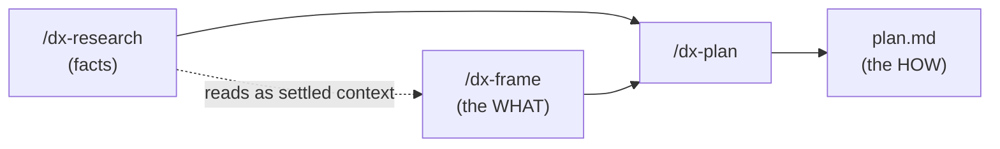

# Understanding research and frame

Before you plan, two optional upstream artifacts can settle the context a plan needs. **Research**
gathers the evidence — the facts. **Frame** settles the problem definition — the WHAT, before any HOW.
Both are optional for a change, and both feed `/dx-plan`. They exist because a perfect plan on the
wrong problem loses the day: dx- would rather you spend a few minutes pinning down facts and framing
than write a beautiful plan for a problem nobody has.

Neither is required. Small, clear work goes straight to `/dx-plan`. But when an area is unfamiliar or a
problem is fuzzy, these two steps stop the plan from guessing.

## Research — gathered evidence with provenance

Research is a deliberate act you initiate. One invocation investigates **one topic** in **one mode** and
writes it down as a durable, provenance-stamped file a later `/dx-frame` or `/dx-plan` can trust without
re-deriving it.

```text
/dx-research <container-id> <topic> [--url=…] [--kind=codebase|external]
```

A change or effort can carry many research files, one per topic. They live at
`<container>/research/<topic>.md` — for example `context/changes/oauth-login/research/google-oauth.md`.
There is **no index file**; `ls research/` derives the list. This is the same derive-don't-maintain rule
that governs the rest of the workflow: no list to update, nothing to fall out of sync.

### Two modes, branched on your input

**Codebase mode** (the default) answers questions about *your* code. It fans out built-in `Explore`
subagents — read-only, no dedicated agents — each on a distinct facet of the topic, including one facet
that searches prior changes and the archive for past work on the same topic so a past decision gets
cited instead of re-derived. It returns concrete `file:line` references and stamps the current HEAD sha
into `git_commit`, so you always know which revision the findings describe.

**External mode** answers questions about the world outside your repo — an unfamiliar library, an API,
prior art. It triggers on a bare URL, a `--url=`, or `--kind=external`. It uses `WebFetch`/`WebSearch`
(no MCP required), synthesizes a summary with inline citations and a fetch date, and records the URL as
`source`. Because there is no code revision involved, `git_commit` is `null`.

One file = one topic = one mode. Keep separate topics in separate files; each is independently
refreshable — re-run the same invocation and it re-stamps the frontmatter.

### Provenance frontmatter

Every research file opens with the same block, so a reader (human or plan) can judge how much to trust it
and how stale it is:

```yaml
---
topic: google-oauth
kind: external            # codebase | external
source: https://developers.google.com/identity/protocols/oauth2
gathered: 2026-07-11
git_commit: null          # a sha in codebase mode; null in external mode
---
```

### Two research homes

| Home | Path | For |
|---|---|---|
| Container-scoped (default) | `<container>/research/<topic>.md` | Facts specific to this change or effort |
| Foundation | `foundation/research/<topic>.md` | Durable, reusable investigations read by every plan |

Most research belongs to the change or effort that needs it and archives with it. But a durable
investigation — often external-doc research like "how our payment provider's webhooks work" — belongs in
`foundation/research/`, where it has no owning container and is read automatically by future plans. Put a
fact there when the next change will want it too.

## Frame — the settled problem definition

Where research gathers facts, `/dx-frame` settles meaning. It runs a **deep interview** on problem
framing and alternatives, then writes `frame.md` in the container's folder. It settles the WHAT — it
never does solution design and never names file changes. That is `/dx-plan`'s job.

```text
/dx-frame <change-id or effort-id>
```

`frame.md` has exactly four sections:

- **The real problem** — one sentence, root not surface. Not "the login button is slow" but the
  underlying thing that, once fixed, makes the surface complaint disappear.
- **Who / what it affects** — the users, systems, or code touched.
- **Alternatives considered** — the framings you weighed, and why the chosen one wins. This is the value:
  it records the roads not taken so a later reader does not relitigate them.
- **Out of scope** — what this explicitly does not address.

Keep it tight and scannable. No solution phases, no file changes — that is planning.

Framing does not have to produce a reframe. **"The initial framing was right" is a valid outcome.** The
point of the interview is to *test* the framing, not to manufacture a new one. If it survives scrutiny,
you have earned confidence, and that is worth the few minutes.

Before framing, `/dx-frame` reads every existing `research/<topic>.md`, any `diagnosis.md`, and any
`brainstorm.md` as settled context, so it never re-asks what research already answered. It reads
`foundation/glossary.md` for naming. If the interview surfaces a term that clashes with the glossary or
is vague or overloaded, it hands off to `/dx-domain` to pin the term down, then returns.

`brainstorm.md`, produced by `/dx-brainstorm`, is a third upstream artifact kind, distinct from both of
the above: research is investigation-with-provenance, frame is problem-framing for work already deemed
worth doing, and a brainstorm records whether it is worth doing at all — including what was rejected and
why the priced do-nothing lost. Running `/dx-frame` on top of a brainstorm is wanted, not redundant: the
frame deepens the brainstorm's conclusion rather than colliding with it. See
[divergent and convergent work](divergent-vs-convergent.md).

## The interview — the shared discipline

Framing and planning both run on the same underlying loop, the **interview**. Misalignment is the
dominant failure mode in software work, and the interview is the cure. It is not a form. Its rules:

1. **Ask exactly one question at a time.** Never present a batch form. Each answer resolves one branch of
   a decision tree and determines the next question.
2. **Offer 2–4 concrete options, with exactly one marked as the recommendation** and a one-line rationale.
   A lone "recommended answer" hides the trade-off and gives you nothing to redirect to but "no"; a short
   option set makes the alternatives visible, so you can accept the recommendation with one word or pick
   another with just as little friction.
3. **If the codebase, a research doc, or the glossary can answer it, explore instead of asking.** Your
   attention is spent only on the genuinely open questions.
4. **Resolve each branch, then let it choose the next question.** Stop when no open branch remains.

The number of questions scales with complexity and then scales *down* by whatever upstream artifacts
already settled — research removes the fact questions, a frame removes the problem-framing questions. How
that scaling works, and how skipping an upstream step changes the questions the plan asks, is the subject
of [handoff scaling](./handoff-scaling.md).

## How the two feed the plan



Research feeds both frame and plan; frame feeds plan. Each artifact you pass forward is a decision
already made — the interview downstream does not re-ask it.

## The key relationship: the interview always happens

This is the part that keeps dx- from forcing ceremony. `/dx-frame` does not *add* the framing interview;
it makes the framing half **explicit and skippable as its own step**. When you skip `/dx-frame`,
`/dx-plan` front-loads the framing questions itself before moving on to solution design.

So you never lose the alignment cure. You only choose *where* it happens:

- Run `/dx-frame` first → framing is settled in `frame.md`, and `/dx-plan` jumps straight to solution
  design.
- Skip it → `/dx-plan` absorbs the framing questions at the top of its own interview.

Small, clear work can go straight to `/dx-plan` and lose nothing. Large or fuzzy work benefits from
making the framing a durable artifact its slices can inherit.

## When to use which

| Situation | Reach for |
|---|---|
| You need FACTS you don't have — an unfamiliar area, an external library, prior art | `/dx-research` |
| The PROBLEM is fuzzy or has competing interpretations | `/dx-frame` |
| The work is small and the problem is already clear | Neither — go to `/dx-plan` |

Research and frame are complementary, not sequential requirements. You might do research with no frame
(you know the problem, you just need facts), a frame with no research (the problem is contested but the
code is familiar), both, or neither.

## The refactor twist

When the work is refactor-type — a `type: refactor` change, or a refactor effort — both `/dx-research`
and `/dx-frame` additionally load the `module-design` vocabulary (deep vs shallow modules, seams, the
deletion test) and frame the investigation in those terms. So a shallow module like `config-loader` gets
described and framed with the same words `/dx-refactor-discover` used to find it, and nothing is lost in
the handoff.

That holds even though `/dx-refactor-discover` now scans through **two** lenses. It also loads
`design-lenses` — SRP, DRY, coupling, and the rest — but only to widen what it *finds*; every finding is
still written in `module-design` terms. A single-responsibility problem arrives as "this module changes
for two unrelated reasons; the seam belongs between them", not as the principle it violates. That is
deliberate: `/dx-research` and `/dx-frame` load `module-design` and not `design-lenses`, so a finding
phrased in principle-names would arrive downstream in a vocabulary nobody there has loaded.

One more thing can ride in on that seed. If you took `/dx-refactor-discover`'s optional design-it-twice
step, the winning interface sketch and the trade-offs that decided it are written into the seed research
file too. So a refactor change can arrive with part of its solution space already explored — which is
the point: the alternatives were weighed when the code was freshest in view, and `/dx-plan` inherits
that judgement instead of re-deriving it.

## Trade-offs and what was deliberately left out

**Both steps are optional and skippable — on purpose.** dx- refuses to force ceremony on small work.
There is no mandatory "research phase" and no gate that blocks planning until a `frame.md` exists. A
one-line typo fix does not need a four-section problem statement.

The safety net that makes this affordable is the interview: it is **never truly skipped, only absorbed**.
Skip `/dx-frame` and `/dx-plan` still asks the framing questions. The alignment cure is preserved no
matter which steps you run — you are only deciding whether the framing becomes a durable, inheritable
artifact or stays inline in the plan interview. That is the whole reason there is no separate "no-plan"
or "no-frame" fast path to maintain: the same loop covers every size of work by scaling its question
count down to near-zero.

## Related

- [Handoff scaling](./handoff-scaling.md) — how skipping upstream artifacts changes the questions the
  plan asks, and how the question count scales.
- [Plan and slices](./plan-and-slices.md) — where research and frame land: the plan that turns the WHAT
  into a HOW.
- [Efforts and changes](./efforts-and-changes.md) — the two containers research and frame attach to, and
  how an effort's upstream is inherited by its slices.
- [The knowledge layer](./knowledge-layer.md) — standards, lessons, and the glossary that the interview
  explores instead of asking.
- [Frame and research tutorial](../tutorials/frame-and-research.md) — a hands-on walkthrough of running
  both steps on a real change.
- [Divergent and convergent work](./divergent-vs-convergent.md) — how `brainstorm.md` relates to research
  and frame as a third upstream artifact kind.
