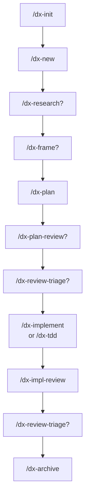

# Understanding the dx- workflow

You just installed a set of Claude Code skills whose names all start with `dx-`. This page
explains what they are as a whole, the handful of design decisions they rest on, and the shape
of the work you'll do with them. Read it first; every other page in this set assumes the picture
drawn here.

## What dx- is

dx- is a lean, file-derived software-development workflow. It ships as a collection of
Claude Code **skills** under the `dx-` prefix — `/dx-init`, `/dx-new`, `/dx-plan`, and so on —
each installed individually with `npx skills`. There is no server, no binary, no background
process. **`dx` is a prefix, not a product brand:** the skills share a naming convention and a
set of conventions on disk, and that is the entire "product."

Just as important is what dx- is *not*. There are no dedicated agents, no orchestrators driving
a pipeline, and no dashboards. The skills are plain markdown instructions that Claude follows,
and the state they operate on is plain markdown you can read, `grep`, and edit by hand.

The guiding rule behind all of it: **trust Claude to reason — principles over process, references
are maps not instructions.** The skills tell Claude *what good work looks like* and let it think,
rather than scripting every keystroke.

## The design thesis

Five load-bearing decisions shape everything else. If you understand these, the rest of the
workflow follows.

**1. File-derived state.** All workflow state lives as markdown under a `context/` directory in
your project. A change's identity is its `change.md` frontmatter; its progress is a checkbox list
in `plan.md`. Nothing is maintained that could instead be *derived*: the list of active changes
comes from `ls context/changes/`, a change's status comes from its frontmatter, an effort's
progress comes from its child changes. There is no separate database to drift out of sync with
reality — the files *are* the reality. See [the directory layout](directory-layout.md) for the
full scaffold.

**2. The user is the workflow engine.** Skills never auto-chain. Each skill does exactly one job,
prints a `Next:` line suggesting what usually comes next, and then **stops**. It does not run the
next command, and it does not copy it to your clipboard — you decide and you type it. This keeps
you in control of every transition and means there is no orchestrator to configure or debug.

**3. A first-class knowledge layer.** Three kinds of durable knowledge get their own artifacts
with their own lifecycles: **standards** (the rulebook, e.g. `context/standards/global/coding-style.md`),
**lessons** (accrued warnings and decisions in `foundation/lessons.md`), and a **domain glossary**
(the project's ubiquitous language in `foundation/glossary.md`). These are read into plans and
verified during review, so knowledge compounds instead of evaporating. See
[the knowledge layer](knowledge-layer.md).

**4. Safety over speed.** Stable reference docs live apart from active work (docs-vs-work
separation), and the workflow **never auto-rolls-back on failure** — when something breaks, the
skill surfaces it and *you* confirm the rollback. dx- would rather stop and ask than silently
undo your work.

**5. Alignment first.** Two recurring failure modes get dedicated cures. Misalignment between what
you want and what gets built is cured by a **one-question-at-a-time interview** (used by `/dx-frame`
and `/dx-plan`): options, a recommendation, one question at a time — never a batch form. Guess-driven
debugging is cured by **feedback-loop-first diagnosis** (`/dx-diagnose`): reproduce and observe
before you theorize. Both are reusable disciplines, not separate workflow tracks.

## The lifecycle

Most of your time is spent moving a single unit of work through one lifecycle. The steps marked
with `?` are optional — you skip them when the work is small or already clear.

Named in order: `/dx-init` (once per project) → `/dx-new` → `/dx-research?` → `/dx-frame?` →
`/dx-plan` → `/dx-plan-review?` → `/dx-review-triage?` → `/dx-implement` or `/dx-tdd` →
`/dx-impl-review` → `/dx-review-triage?` → `/dx-archive`.

- **`/dx-init`** scaffolds `context/` and writes the rollback principle into your project's
  `CLAUDE.md`. You run it once.
- **`/dx-new`** is the universal entry point. It creates the container for a piece of work and
  routes between the two levels (see below).
- **`/dx-research`** and **`/dx-frame`** are the optional upstream steps: research gathers what you
  need to know (codebase and external), framing interviews you to pin down scope and approach. See
  [research and framing](research-and-frame.md).
- **`/dx-plan`** writes `plan.md` with phases and a `## Progress` checklist. If you skipped framing,
  it front-loads the framing questions itself.
- **`/dx-plan-review`** is an optional pre-implementation gate that reads the plan and reports
  findings. **`/dx-impl-review`** is the post-implementation gate that also checks standards
  compliance. Both gates are **report-only** — they never edit code.
- **`/dx-review-triage`** is the one skill that turns a gate's findings into actual changes. It is
  optional because a clean review has nothing to triage. See [review and triage](../tutorials/review-and-triage.md).
- **`/dx-implement`** and **`/dx-tdd`** are siblings that share one `## Progress` section, so a
  test-first and a straight-implementation pass can interleave on the same change. See
  [implement vs TDD](implement-vs-tdd.md).
- **`/dx-archive`** moves the finished work into `context/archive/`.

A change moves through the statuses `new → planned → implementing → implemented → reviewed →
archived`, each flip recorded in `change.md` frontmatter — so `ls` plus a frontmatter read always
tells you exactly where things stand.

### The effort variant

The lifecycle above is for a single **change**. When the work is large enough to decompose,
`/dx-new` routes you to an **effort** instead, which adds two things to the flow: `/dx-roadmap`
breaks the effort into vertical slices, and you run `/dx-new <effort> <slice>` per slice to spawn
a child change that inherits the effort's research and framing. Each child change then follows the
normal lifecycle above. Efforts have their own status track: `new → scoped → in-progress → done →
archived`.

## The two container levels

Everything lives in one of two containers, and the distinction is worth internalizing early:

- A **change** is one shippable unit — for example `oauth-login`, "Add Google sign-in". It has a
  `change.md`, a `plan.md`, and a `## Progress` checklist.
- An **effort** is larger work that decomposes into changes — for example `payments-v2`, "Rebuild
  payments flow", split into slices like `payments-schema`, `payments-api`, and `payments-ui`.

`/dx-new` is the router that picks the level. For the full model — why two levels exist, how a
slice inherits its parent's framing, and how the four entry shapes converge —
see [efforts and changes](efforts-and-changes.md).

## How skills fire: model-invoked vs user-invoked

Almost every dx- skill is **user-invoked**: it does nothing until you type its slash command. This
is deliberate. User-invoked skills carry **zero context load** — Claude doesn't hold their trigger
descriptions in mind, so having twenty of them installed costs you nothing until you reach for one.

Exactly **two** skills are **model-invoked** — they fire on their own when the situation matches:

| Skill | Fires when |
|---|---|
| `/dx-diagnose` | You report something broken, slow, failing, or wrong. |
| `/dx-domain` | A domain term is vague, overloaded, or clashes with the glossary, mid-task. |

These two earn their ambient cost because their value depends on catching the moment — you
shouldn't have to remember to invoke a debugging discipline the instant you hit a bug. Everything
else waits for you to ask.

## What was deliberately left out

dx- cuts a lot on purpose. Each omission is a decision, not an oversight:

- **No dedicated agents.** Skills are enough. A dedicated agent only earns its keep when the harness
  must *enforce* a capability limit (e.g. a truly read-only reviewer) or to move large reused
  instructions out of context — neither applies here. When the workflow needs fan-out (like
  research), it spawns Claude Code's built-in `Explore` subagents inline. Keeping to a single
  artifact type (skills) makes the whole thing simpler to ship, install, and reason about.
- **No orchestrators.** The user is the engine. A migration isn't a special workflow — it's just a
  change whose `plan.md` includes a rollback phase. There is nothing to drive a pipeline because
  you drive it.
- **No HTML dashboards or `.html` reports.** State is markdown you already have tools to read.
  A dashboard would be one more thing to keep in sync with the files that are the real source of truth.
- **No issue-tracker sync.** The artifacts in `context/` *are* the source of truth, not a mirror of
  Jira or GitHub Issues. An optional sync adapter could be built later; it is out of scope now.
- **No ADR register.** Decisions and their rationale live as **lessons** (cautionary) or **standards**
  (normative). A third register would just fragment where decisions live.

The through-line: dx- adds a container only when work genuinely needs one, and adds a discipline only
where a real failure mode recurs. Everything speculative is cut.

## Related

- [Understanding the directory layout](directory-layout.md) — the `context/` scaffold that holds all
  file-derived state.
- [Efforts and changes](efforts-and-changes.md) — the two container levels in depth, and how `/dx-new` routes.
- [The knowledge layer](knowledge-layer.md) — how standards, lessons, and the glossary compound across work.
- [Plans and slices](plan-and-slices.md) — how `plan.md`, `## Progress`, and roadmap slices fit together.
- [Initialize a project](../tutorials/initialize-a-project.md) — run `/dx-init` and see the scaffold appear.
- [Ship a change](../tutorials/ship-a-change.md) — walk one change end-to-end through the lifecycle.
