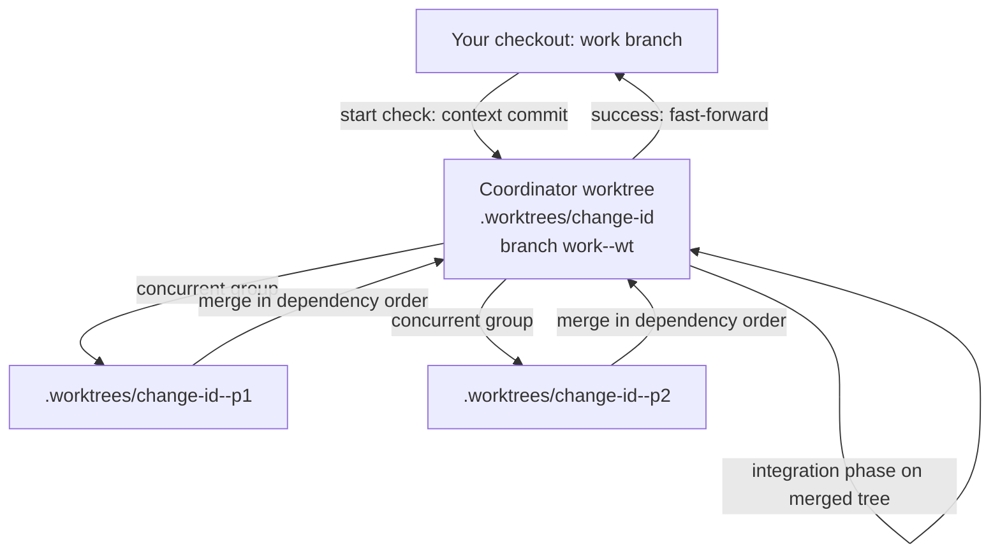

# Understanding worktree isolation

`/dx-implement` in auto mode does not edit your checkout. It builds the change in a separate [git worktree](https://git-scm.com/docs/git-worktree) and only moves your branch forward when everything is green. This page explains why, how the pieces fit together, and the one trade-off you accept for it.

## Why worktrees

Auto mode runs many phases, some of them concurrently. Doing that in your working tree has three problems:

- **You can't keep working.** Half-written phases sit in the files you have open, and a red check leaves your tree broken.
- **Concurrent phases collide.** Two subagents editing one tree overwrite each other and share one set of build outputs and ports.
- **Two changes can't run at once.** Each run needs a tree it owns.

A worktree is a second checkout of the same repository, with its own files and its own branch but one shared history. That gives each run a tree it owns, and git does the merging when phases come back together.

## The shape of a run

- **Start check.** Before anything else, `/dx-implement` (and `/dx-tdd`) resolve the work branch and commit the change's `context/` files. The work branch is your current non-default branch, a branch you name, or a question when you are on the default branch. dx- never picks a name for you.
- **Coordinator worktree.** `.worktrees/<change-id>`, on a scratch branch `<work-branch>--wt` cut from your work branch. It needs its own branch because git allows a branch in only one worktree and your checkout already holds the work branch. Serial phases run here, one subagent each.
- **Phase worktrees.** Only phases that run concurrently get their own: sibling folders `.worktrees/<change-id>--p<N>` on branches `<work-branch>--p<N>`, branched from the coordinator's HEAD. They are never nested inside the coordinator's folder.
- **Merge-back.** When a group finishes, the coordinator commits each member and merges them in dependency order. On a conflict a resolver agent may edit only the conflicted files, and the group's checks must pass afterward. Otherwise the in-progress merge is aborted and the run stops.
- **Finish.** The work branch is fast-forwarded to the coordinator's HEAD. If it moved since the worktree was cut, for example because you committed, the run stops and leaves the merge or rebase to you. Nothing is forced.

`context/` stays in your main checkout. The coordinator is its only writer: it ticks Progress, appends subagent notes to `handoff.md` and makes the commits. Subagents read `plan.md` and friends from the main-checkout path, because a worktree's committed copy of `context/` goes stale as Progress is edited.

## The `(isolated)` and `(integrated)` split

A check can only run where the things it needs exist. `/dx-plan` therefore tags every `#### Automated` row in a parallel plan:

- **`(isolated)`** needs only the phase's own source tree: typecheck, lint, pure unit tests. It runs in the phase's worktree, in parallel with its siblings, and a red one stops that group from merging.
- **`(integrated)`** needs something shared or something from another phase: a port, a dev server, a database, another phase's code, e2e. Run in a phase worktree it would collide with a sibling or fail for lack of code that hasn't merged yet. It runs once on the merged tree, in the group's synthetic **integration phase**.

The split also settles blame. A red `(isolated)` check points at one phase. A red `(integrated)` check points at the combination, and the run hands unclear causes to `/dx-diagnose` instead of bisecting phases. Plans without a parallel group have no integration phase and the tags are optional. See [plans and slices](plan-and-slices.md) for how the plan carries them.

Each worktree gets its own dependency install from the lockfile, skipped when nothing needs installing. A phase that changes dependencies is never run in parallel: `/dx-plan` gives it a `Depends on:` that serializes it.

## Keep on stop, clean on success

Any red check, conflict, install failure or moved branch stops the run, and a stop **keeps everything**: every worktree, every scratch branch, every box unticked. Nothing is reverted, which is the workflow's never-auto-rollback principle applied to merges too. Re-running `/dx-implement <change-id>` reattaches to the kept coordinator worktree, cross-checks the last SHA recorded in Progress against its log, and resumes.

Only a full success removes `.worktrees/<change-id>*` and deletes the scratch branches. Your work branch stays, and its commits are the result.

A kept worktree has one consequence. Its commits are not on your work branch yet, so `/dx-tdd` and `/dx-implement --manual` stop and point you at `/dx-implement`, rather than run on a branch missing the code of phases Progress shows as done.

## The trade-off: `.worktrees/` lives inside your repo

Worktrees are created under `.worktrees/` in the repository, not in a sibling folder. That keeps them next to the project, easy to find and easy to delete. `/dx-init` adds `.worktrees/` to `.gitignore`, and `/dx-implement` stops and points you back at `/dx-init` if the entry is missing.

The cost, stated plainly: **git ignores `.worktrees/`, but repo-wide tools may not.** Linters, file globs, editors' search, test runners and watchers that walk the folder tree can see the extra copies of your source, and may lint, index or run tests in them. dx- does not add configuration for this. If a tool picks the folder up, exclude `.worktrees/` in that tool's own settings.

Each worktree is a full checkout and a full dependency install, so a parallel group also costs disk space until the run succeeds or you delete the folders.

## What was left out

- **No cleanup on a stop.** Keeping worktrees means a stopped run costs disk space, but it never destroys evidence of what went wrong.
- **No per-phase bisecting.** One `(integrated)` run per group is enough to say "the merge is red"; finding why is `/dx-diagnose`'s job.
- **No worktree for `--manual` or `/dx-tdd`.** A single phase you are watching has no isolation problem to solve.

## Related

- [Run parallel phases in worktrees](../tutorials/run-parallel-phases-in-worktrees.md) — a hands-on walkthrough, including a stop and a resume.
- [Plans and slices](plan-and-slices.md) — where the tags and the integration phase come from.
- [Implement vs TDD](implement-vs-tdd.md) — the one-phase siblings and the shared start check.
- [Skill reference](../reference/skills.md) — `/dx-implement`, `/dx-plan`, `/dx-init`.
