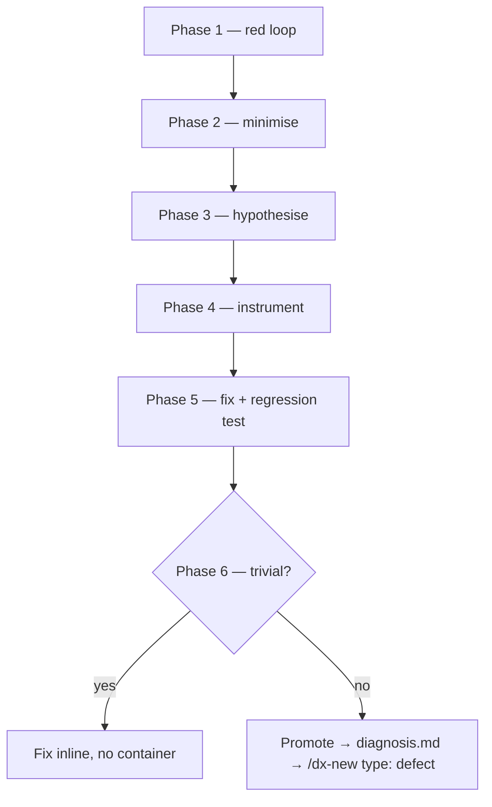

# Diagnose a bug with dx-diagnose

In this tutorial you will chase down a real defect — a checkout page whose cart total is wrong because it ignores shipping — using `/dx-diagnose`. You will build a feedback loop *before* guessing, walk the six phases from red loop to regression test, and then see the two ways a diagnosis can end: a trivial fix that stays inline, or a non-trivial one that gets **promoted** into a change. By the end you will have either a fix plus a regression test on disk, or a `diagnosis.md` seeding a `type: defect` change. No prior dx- experience needed.

`/dx-diagnose` is special. It is one of only two skills in the set that Claude invokes **on its own** (the other is `/dx-domain`) — it auto-fires the moment you describe something as *broken*, *slow*, *throwing*, *failing*, *crashing*, *hanging*, *flaky*, or *regressed*. So it can surface mid-work: if you are deep in `/dx-implement` and hit a defect, it takes over, diagnoses, and hands back — it will not silently resume the skill it interrupted. You can also call it explicitly, which is what this tutorial does. For where it sits among the skills, see [the skills reference](../reference/skills.md).

Its one non-negotiable rule: **no red-capable loop, no hypothesising.** You do not get to theorise about the cause until you have a command that reproduces the bug and goes red on it. Catching yourself reasoning about the fix before that loop exists is the exact failure this skill prevents.

The whole run is six phases feeding a single branch point at the end:



## Prerequisites

- The dx- skills installed and a project that actually contains the bug — here, a `cartTotal()` (or similar) whose output is wrong because shipping is excluded. You need to be able to run the project's tests.
- `/dx-init` already run in the project **if you might promote** the bug into a change — see [Initialize a project](initialize-a-project.md). A trivial inline fix needs no scaffold; promotion writes into `context/changes/`, which `/dx-init` creates.

## Step 1 — Invoke dx-diagnose on the symptom

State the symptom in the project's own terms. You can let it auto-fire from a plain complaint, but here you call it explicitly with the symptom as the argument.

```text
/dx-diagnose "cart total is wrong — ignores shipping"
```

> **dx-diagnose** reads `foundation/glossary.md` if present (a one-line habit — name the symptom the way the domain does), notes there is no container yet (this runs ad-hoc on a raw symptom), and goes straight to Phase 1. It does **not** start guessing at causes — it announces it will build a red loop first.

## Phase 1 — Build a tight, red-capable loop

This phase *is* the skill. Before anything else, the agent names **one command** it has already run once that goes red on this exact bug, and pastes the invocation and output.

> **dx-diagnose** writes a failing test that asserts the exact total the user expects, runs it once, and pastes proof it is red:
>
> ```text
> $ npx vitest run test/cart-total.test.ts
>
>  FAIL  test/cart-total.test.ts > cartTotal includes shipping
>    expected 53.00 to equal 58.00
>      subtotal 48.00 + shipping 5.00 → expected 53.00
>      cartTotal() returned 48.00
>
>  Test Files  1 failed (1)
> ```
>
> This loop **goes red on THIS bug** — it drives the real `cartTotal()` code path and asserts the user's exact symptom, not merely "runs without erroring." It is deterministic and runs in seconds. Only now, with a red loop in hand, does diagnosis proceed.

The loop is most of the fix. It is deterministic (no flakiness to raise the reproduction rate on here) and fast. If the agent genuinely could not build one, the rule is to stop and say so — list what was tried, ask for an environment, artifact, or instrumentation — never to fall back on theorising.

## Phase 2 — Reproduce and minimise

Run the loop red, confirm it is *your* symptom and not a nearby one, then shrink the scenario until every element is load-bearing.

> **dx-diagnose** confirms the failure is the reported one (total short by exactly the shipping amount, not a rounding or tax bug), then minimises the repro — cutting inputs one at a time and re-running each cut:
>
> - drops the coupon line → still red
> - drops the second cart item → still red
> - drops tax config → still red
> - one item + a non-zero shipping rate → **still red; cannot cut further**
>
> Every remaining element is now load-bearing: a single item plus a shipping rate is the smallest scenario that reproduces the wrong total.

## Phase 3 — Hypothesise (3–5, ranked, falsifiable)

Only now — with a minimal red loop — does the agent guess. It generates several hypotheses *before testing any one*, because a single hypothesis anchors on the first plausible idea. Each carries a **prediction**: if this is the cause, changing that flips the verdict. No prediction means it is a vibe. The ranked list is shown to you before any instrumenting, so you can re-rank instantly:

> **dx-diagnose** presents four ranked, falsifiable hypotheses:
>
> **H1 (most likely).** `cartTotal()` sums line items but never adds `order.shipping`.
> *Prediction: adding `order.shipping` into the sum flips the test green.*
>
> **H2.** Shipping is summed but under a different key (`shippingCost` vs `shipping`), so it reads `undefined` → `0`.
> *Prediction: logging the resolved shipping value shows `undefined`, not `5.00`.*
>
> **H3.** Shipping is added *after* `cartTotal()` returns, in a caller the test bypasses.
> *Prediction: the app's own checkout path is correct and only the test is wrong.*
>
> **H4 (least likely).** A rounding/coercion step drops the shipping cents.
> *Prediction: the shortfall would not equal the full shipping amount — but it does (exactly 5.00).*
>
> It proceeds on this ranking; if you were at the keyboard you could re-rank before it moves on.

## Phase 4 — Instrument (one variable at a time)

Each probe maps to exactly one prediction from Phase 3 — no "log everything." Debug logs are tagged with a unique prefix so cleanup is a single grep.

> **dx-diagnose** tests H1 first by inspecting the sum inside `cartTotal()`, tagging the probe:
>
> ```text
> [DEBUG-a4f2] cartTotal: lineSum=48.00 shippingApplied=false order.shipping=5.00
> ```
>
> The probe confirms H1 and kills the rest in one shot: `order.shipping` is present (5.00) and *not* `undefined`, so H2 is out; the value is available inside `cartTotal()` where it should be added, so H3 is out; the shortfall is exactly the shipping amount, so H4 is out. `cartTotal()` computes `lineSum` and returns it without ever adding `order.shipping`.

## Phase 5 — Fix and regression test

Write the regression test *first* if a correct seam exists — one that exercises the real bug at its call site. Then fix, watch red turn green, and re-run the Phase 1 loop against the original, un-minimised scenario.

> **dx-diagnose** already has the seam — the Phase 1 failing test *is* the regression test, asserting `cartTotal()` includes shipping at its real call site. It applies the fix (add `order.shipping` to the returned sum), then:
>
> ```text
> $ npx vitest run test/cart-total.test.ts
>  PASS  test/cart-total.test.ts > cartTotal includes shipping  (58.00)
> ```
>
> It re-runs the original full scenario (all items, coupon, tax) — the total is now correct end to end, not just in the minimised case.

## Phase 6 — Cleanup and outcome

The bar for done: the original repro is gone, the regression test is green, every `[DEBUG-…]` line is removed, and throwaway harnesses are deleted. The agent states the winning hypothesis, then decides how the diagnosis ends.

> **dx-diagnose** greps for `[DEBUG-` and removes the one probe, deletes no other harness (there was none), confirms the regression test stays, and states the winner: **H1 — `cartTotal()` never added `order.shipping`.** Then it branches on triviality.

The branch is the whole decision. It hinges on how big the fix is — not on how hard the bug was to find.

## The two outcomes

### Branch A — Trivial: fix inline, no container

A one-line cause with a one-test fix does not deserve a change folder. The fix and its regression test stay inline; no `diagnosis.md`, no `context/changes/` entry. And — as everywhere in dx- — the fix is **never auto-rolled-back**; a defect that turns out real stays fixed.

> **dx-diagnose** prints the trivial outcome and stops:
>
> ```text
> Fixed inline: shipping was excluded from subtotal in cartTotal(). Regression test: test/cart-total.test.ts
> ```

That is the end of the road for a trivial bug. No lifecycle, no ceremony.

### Branch B — Non-trivial: promote to a change

If the fix is broad — it touches pricing across several call sites, needs a schema change, or wants real design review — the bug graduates into the normal change lifecycle. The agent writes a `diagnosis.md` capturing the minimised repro, the ranked hypotheses, and the regression test, then creates a change with `/dx-new` stamped `type: defect`. That type is what activates the TDD gate in `/dx-plan`.

> **dx-diagnose** writes the diagnosis and creates the change, then prints:
>
> ```text
> Diagnosis written: context/changes/checkout-total/diagnosis.md
> Next: /dx-plan checkout-total   (defect → TDD gate)
> ```

A realistic, trimmed `context/changes/checkout-total/diagnosis.md`:

```markdown
---
change_id: checkout-total
symptom: cart total is wrong — ignores shipping
diagnosed: 2026-07-11
git_commit: 7c4a1e90b2d5f3a8c1e6b04d92f7a3c5e8811fb2
winning_hypothesis: H1 — cartTotal() never adds order.shipping
---

## Minimised repro

One cart item + a non-zero shipping rate. Everything else (coupon, second
item, tax config) cut without changing the verdict.

    npx vitest run test/cart-total.test.ts
    expected 53.00, got 48.00   (short by shipping = 5.00)

## Ranked hypotheses

1. **H1 (confirmed)** — cartTotal() sums line items but never adds
   `order.shipping`. Probe [DEBUG-a4f2] showed shippingApplied=false with
   order.shipping=5.00 present.
2. H2 — wrong key (shippingCost vs shipping) → undefined. Ruled out: value
   resolved to 5.00, not undefined.
3. H3 — shipping added in a caller the test bypasses. Ruled out: app path
   also wrong.
4. H4 — rounding drops shipping cents. Ruled out: shortfall == full shipping.

## Regression test

`test/cart-total.test.ts` — asserts cartTotal() includes shipping at its real
call site. Currently red; must be green before archive.
```

From here it is the ordinary lifecycle. `/dx-plan checkout-total` reads `diagnosis.md` the same way it reads research — the minimised repro and ranked hypotheses feed straight into planning. Because the change is stamped `type: defect`, the plan **activates a TDD gate**: you write the failing test first and drive it green, so you will most likely reach for `/dx-tdd` rather than `/dx-implement`. For which one and why, see [Implement vs TDD](../explanation/implement-vs-tdd.md); for the end-to-end change flow, see [Ship a change](ship-a-change.md).

Note that `/dx-diagnose` prints a `Next:` line and **stops** — it never chains into `/dx-plan` for you. You run the next command.

## What you built

Depending on the branch, you now have on disk:

- **Trivial branch** — a fixed `cartTotal()` and a regression test at `test/cart-total.test.ts`, both inline. No container, no artifacts.
- **Promoted branch** — `context/changes/checkout-total/diagnosis.md` (minimised repro + ranked hypotheses + regression test) and a `change.md` with `type: defect`, `status: new`, ready for `/dx-plan`.

Either way: the original repro no longer reproduces, the regression test is green, and every `[DEBUG-…]` probe and throwaway harness is gone.

## Where to next

- Took Branch B? Carry the defect through the rest of the lifecycle — [Ship a change](ship-a-change.md) walks plan → implement/TDD → review → archive.
- When a plan or implementation review surfaces findings, [Review and triage](review-and-triage.md) is the one skill that acts on them.

## Related

- [Skills reference](../reference/skills.md) — where `/dx-diagnose` sits, and its Reads/Writes/Next.
- [Ship a change](ship-a-change.md) — the lifecycle a promoted defect flows into.
- [Implement vs TDD](../explanation/implement-vs-tdd.md) — why `type: defect` steers you to `/dx-tdd`.
- [Review and triage](review-and-triage.md) — acting on review findings after the fix lands.
- [Initialize a project](initialize-a-project.md) — creates the `context/` scaffold promotion writes into.
