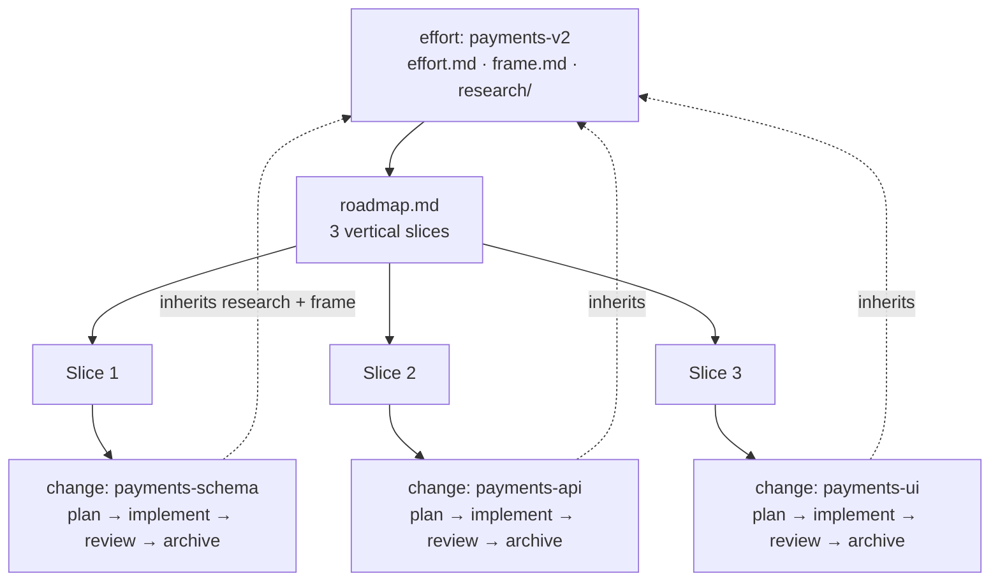

# Run a bigger effort with a roadmap

In this tutorial you will take a piece of work that is too big for a single change, route it into an
**effort**, decompose it into ordered **vertical slices** with a roadmap, and ship those slices one at
a time as child changes. By the end you will have `context/efforts/payments-v2/` on disk with a
`roadmap.md` of three slices, and your first child change created and ready to plan. No prior dx-
experience needed.

## When to use an effort instead of a change

Most work is a **change** — one shippable unit that goes straight through the change lifecycle. Reach
for an **effort** only when the work is genuinely too big for one shippable unit *and* it decomposes
into smaller pieces that each stand on their own. "Rebuild the payments flow" is a whole system —
schema, API, and UI — that no single change should swallow. That is an effort.

The reliable test: if you can't ship it in one reviewable change, but you *can* break it into a few
end-to-end slices that each ship independently, it's an effort. If it wants only one slice, it was a
change all along. For the full distinction, see
[efforts and changes](../explanation/efforts-and-changes.md).

An effort never nests changes inside changes. It is a container that *produces* a flat set of child
changes, one per slice. Each child then runs the ordinary change lifecycle you already know.

## Prerequisites

- The dx- skills installed in Claude Code — see [the skills reference](../reference/skills.md).
- A project with the `context/` scaffold already in place. If you haven't scaffolded yet, run
  [Initialize a project](initialize-a-project.md) first — `/dx-init` is the entry point for everything
  below.
- Claude Code open with that project as the working directory.

## Step 1 — Route the work to an effort with `/dx-new`

Everything starts at `/dx-new`. Describe the work; the skill sizes it and picks the container level.

```text
/dx-new "rebuild payments flow"
```

> **dx-new** judges this too large for a single change — it spans schema, API, and UI — and routes it
> to an **effort**. It derives the id `payments-v2`, scaffolds `context/efforts/payments-v2/`, and
> writes an `effort.md` at `status: new` with a one-paragraph `## Goal`:
>
> ```markdown
> ---
> effort_id: payments-v2
> title: "Rebuild payments flow"
> status: new
> created: 2026-07-11
> updated: 2026-07-11
> ---
>
> # Rebuild payments flow
>
> ## Goal
> Replace the legacy single-table payments flow with a normalized schema, a versioned payment
> API, and a rebuilt checkout UI. Each layer ships end-to-end on its own so we can migrate
> incrementally and keep the old flow running until the new one is proven.
> ```
>
> Then it stops and prints:
>
> ```text
> Next: /dx-research payments-v2 <topic>   → /dx-frame payments-v2   → /dx-roadmap payments-v2
> ```

`/dx-new` only creates the identity file and points at the next step — it does not research, frame, or
decompose. dx- skills never auto-chain: each does one job, prints a `Next:` line, and stops.

## Step 2 — Do the upstream work once, at the effort level

Before decomposing, settle the shared context that every slice will build on. Do research and framing
**at the effort level** — this is the payoff of an effort, and it only happens once.

```text
/dx-research payments-v2 current-flow
```

> **dx-research** investigates the existing payments code and writes its findings to
> `context/efforts/payments-v2/research/current-flow.md` — the seams in the legacy schema, where money
> values are computed, what the current API exposes.

```text
/dx-frame payments-v2
```

> **dx-frame** interviews you on the problem shape, alternatives, and risks, then writes
> `context/efforts/payments-v2/frame.md`.

Keep this light here — the mechanics of both skills are covered in
[Frame and research a change](frame-and-research.md). The one thing that matters for efforts:

**This research and frame are shared.** Every child change inherits them in place — nothing is copied
per slice. You frame the *whole effort* once, and all three slices plan against the same settled
context. That is exactly what you don't get from three unrelated changes.

## Step 3 — Decompose into vertical slices with `/dx-roadmap`

Now turn the framed effort into an ordered sequence of slices.

```text
/dx-roadmap payments-v2
```

> **dx-roadmap** reads `effort.md`'s `## Goal`, every `research/<topic>.md`, and `frame.md`, then
> drafts candidate slices — each one a **tracer bullet** that cuts end-to-end through the layers it
> touches, not a horizontal layer. Dependency order alone rarely picks a unique sequence, so it runs a
> short **anchor interview** — two tie-break questions, one at a time, each with a recommendation:
>
> **Q1. Tie-break bias — when several slices are equally free to go first, what decides?**
> 1. Surface the riskiest assumption first — front-load the schema migration risk **(recommended)**
> 2. Ship the smallest demoable thing first
> 3. Strict dependency order, no further bias
>
> **You:** 1
>
> **Q2. Which slice leads?** Among the candidates with no unmet dependency:
> 1. Schema + persistence — everything downstream needs it **(recommended)**
> 2. Payment API
>
> **You:** 1
>
> It topologically sorts the candidates, applies the bias, shows the numbered list for you to confirm
> (proceed / reorder / cancel), then writes `roadmap.md` and flips `effort.md` to `status: scoped`.

The written `context/efforts/payments-v2/roadmap.md` looks like this:

```markdown
## Roadmap
> A slice is done when its child change is archived (`archived_at` set) — derived by scanning the child, never a hand-checked box.

### Slice 1: Schema + persistence          # end-to-end tracer
- change: payments-schema
- why: everything downstream depends on the new schema
- next: `/dx-new payments-v2 1`
### Slice 2: Payment API
- change: payments-api
- why: exposes the schema over the API
- next: `/dx-new payments-v2 2`
### Slice 3: Checkout UI
- change: payments-ui
- why: user-facing surface, last
- next: `/dx-new payments-v2 3`
```

Two things to internalize:

- **Slices are vertical, not horizontal.** Slice 1 isn't "write all the schema code." It's a complete
  tracer bullet — enough schema *plus* the persistence wiring to demo end-to-end. Horizontal layers
  ("all schema, then all API, then all UI") don't ship independently; vertical slices do. See
  [plans and slices](../explanation/plan-and-slices.md) for why this matters.
- **Progress is derived, never hand-maintained.** The roadmap has no checkboxes to tick. A slice is
  done when its child change is archived — dx- reads that from the child's `archived_at`, so the
  roadmap can't drift out of sync with reality.

`/dx-roadmap` finishes and prints:

```text
Roadmap written: context/efforts/payments-v2/roadmap.md — 3 slices
Next: /dx-new payments-v2 1   — create the first slice's child change (also in roadmap.md's Slice 1 `next` line)
```

## Step 4 — Create the first slice's child change with `/dx-new`

The `next` line — and Slice 1's own `next:` inside the roadmap — both point back to `/dx-new`, this
time with an effort id and a slice number.

```text
/dx-new payments-v2 1
```

> **dx-new** recognizes this as a **child change**, not a new top-level item. It reads
> `roadmap.md`'s `### Slice 1`, takes the id `payments-schema` from its `- change:` line **as-is** (it
> does not invent a new slug — that would orphan the roadmap link), and scaffolds
> `context/changes/payments-schema/change.md` with `effort: payments-v2` and `slice: 1`:
>
> ```markdown
> ---
> change_id: payments-schema
> title: "Schema + persistence"
> type: feature
> effort: payments-v2
> slice: 1
> status: new
> created: 2026-07-11
> updated: 2026-07-11
> archived_at: null
> ---
> ```
>
> The child **inherits** the effort's `research/` and `frame.md` in place — nothing is copied, it reads
> them from the parent effort. Because upstream is already settled, there's nothing to research or frame
> here; it jumps straight to planning and prints:
>
> ```text
> Next: /dx-frame payments-schema   → /dx-plan payments-schema    (frame optional — adds this slice's own user cases)
> ```

That inheritance is the whole point of the two-level model: you did research and frame once in Step 2,
and every slice starts from it for free. `payments-schema` is a schema/persistence slice with nothing
user-facing to add, so it skips straight to `/dx-plan`. A later, user-facing slice — say `payments-ui` —
could run `/dx-frame payments-ui` first: it would detect the parent effort's `frame.md` and switch to a
narrower slice mode that only adds this slice's own `## User cases`, on top of whatever headline flows
the effort-level frame already sketched.

## Step 5 — Ship each slice as a normal change, then move to the next

From here, `payments-schema` is an ordinary change. It runs the **exact same lifecycle** as any
standalone change — plan, implement, review, archive:

```text
/dx-plan payments-schema
```

> **dx-plan** plans against the inherited effort research and frame, writes
> `context/changes/payments-schema/plan.md` with a `## Progress` section, and flips the change to
> `status: planned`. From there it's implement → impl-review → archive, unchanged.

The full walk-through of that lifecycle is [Ship a change](ship-a-change.md) — it applies verbatim to a
child change, so it isn't repeated here.

When `payments-schema` is archived, create the next slice the same way:

```text
/dx-new payments-v2 2
```

> **dx-new** reads Slice 2, creates `context/changes/payments-api/change.md` (`slice: 2`, inheriting
> the effort's upstream), and points you at `/dx-plan payments-api`.

Repeat for `payments-v2 3` (`payments-ui`) and the effort is complete.

**Effort progress is derived, not tracked.** dx- doesn't keep a status counter you update by hand. The
effort is done when *every* child change is archived — computed by scanning each child's `archived_at`.
When all three slices are archived, close the effort:

```text
/dx-archive payments-v2
```

> **dx-archive** checks that every child change (`payments-schema`, `payments-api`, `payments-ui`) is
> archived first. If one isn't, it refuses and names the open slice. Once all are done, it moves the
> effort under `context/archive/` and flips it to `status: archived`.

Here is the whole structure — effort at the top, roadmap in the middle, flat child changes at the
bottom, each running its own change lifecycle:



## What you built

After this session your project has, on disk:

- `context/efforts/payments-v2/effort.md` — the effort identity, now at `status: scoped`, with a
  one-paragraph `## Goal`.
- `context/efforts/payments-v2/research/current-flow.md` and `frame.md` — the **shared** upstream every
  slice inherits.
- `context/efforts/payments-v2/roadmap.md` — three ordered vertical slices, each naming exactly one
  child change id and a copy-pasteable `next` command.
- `context/changes/payments-schema/change.md` — the first child change (`effort: payments-v2`,
  `slice: 1`, `status: new`), ready to plan.

## Where to next

- [Ship a change](ship-a-change.md) — run `payments-schema` (and each following slice) through the full
  plan → implement → review → archive lifecycle. This is the natural next tutorial.
- [Find refactors](find-refactors.md) — surface refactor work; a large refactor becomes a refactor
  effort with one slice per module deepening.

## Related

- [Efforts and changes](../explanation/efforts-and-changes.md) — when work is an effort vs a change, and
  why efforts never nest.
- [Plans and slices](../explanation/plan-and-slices.md) — what makes a slice *vertical* and how a slice
  becomes a child change.
- [Frame and research a change](frame-and-research.md) — the upstream skills you ran once at the effort
  level in Step 2.
- [Ship a change](ship-a-change.md) — the change lifecycle each child slice runs.
- [Skills reference](../reference/skills.md) — `/dx-new`, `/dx-roadmap`, and `/dx-archive` at a glance.
